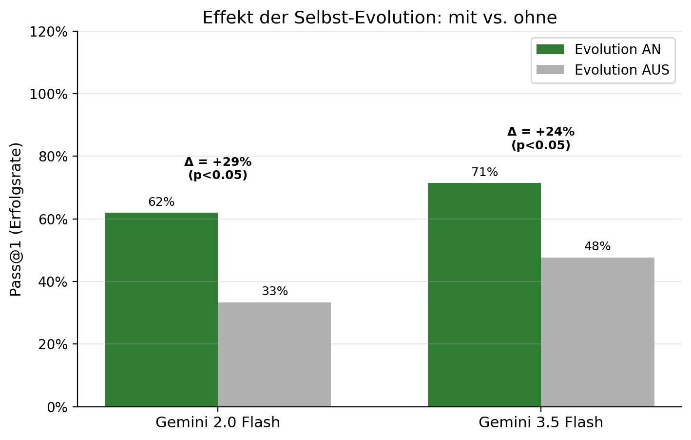
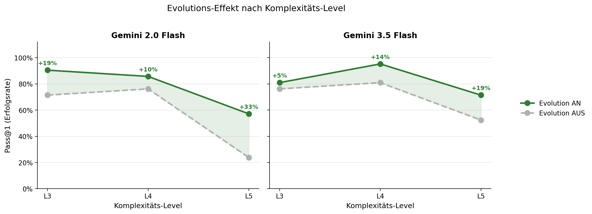
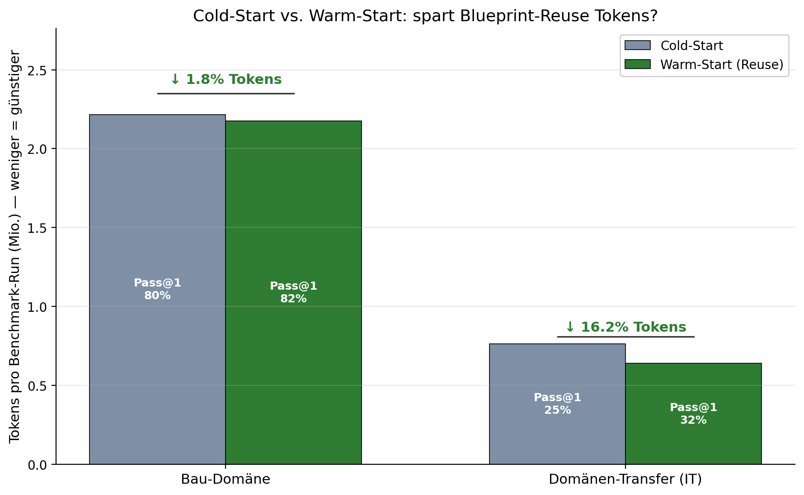
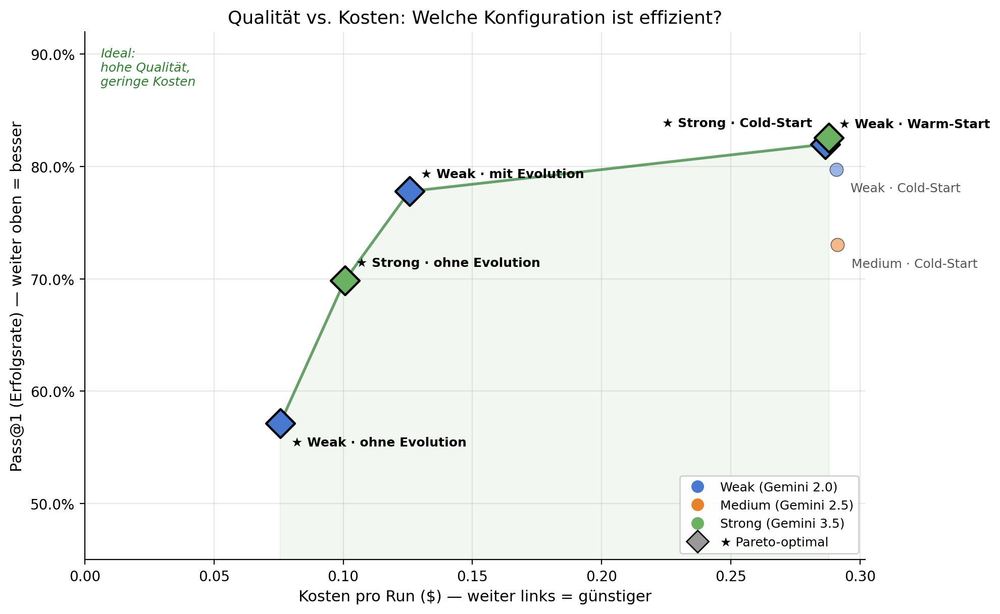
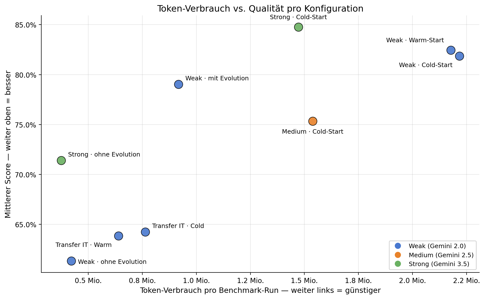
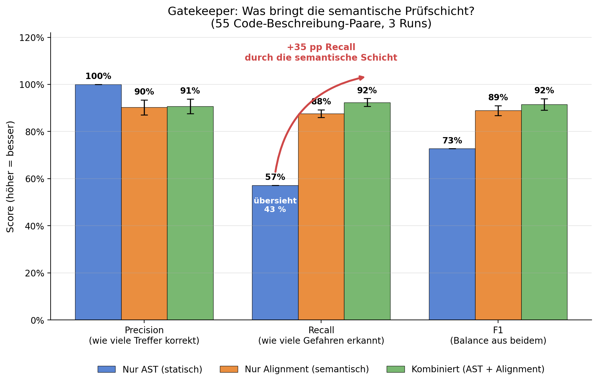
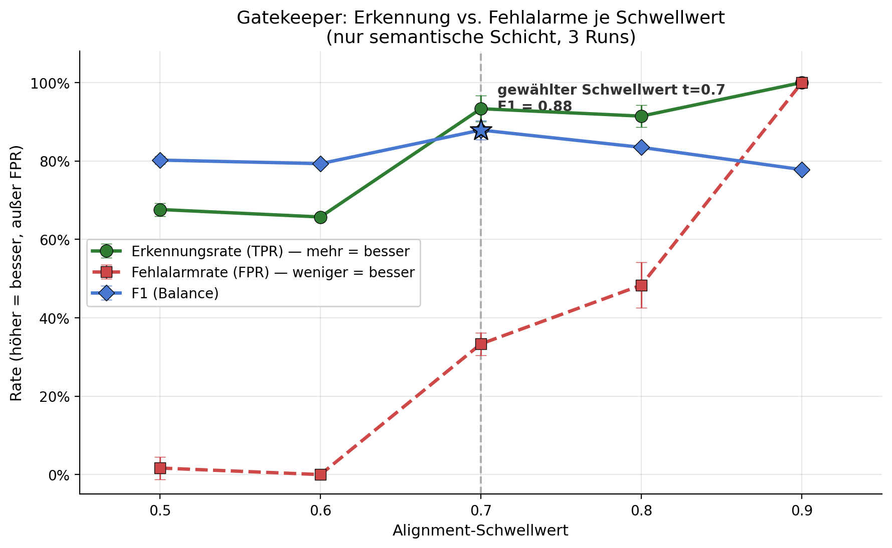

## Experimentelle Ergebnisse

Evaluiert wurde auf einem **Progressive-Complexity-Benchmark** (Aufgaben der Stufen L1–L5, Domäne Bau + Domänen-Transfer IT). Alle Zahlen stammen aus `backend/results/thesis/analysis/statistics.json` und den Roh-Runs; jede Konfiguration wurde über **3 Seeds** gemittelt. Statistische Tests: Wilcoxon-Signed-Rank (gepaart) bzw. Friedman.

> Rohdaten und alle 12 Plots: [`backend/results/thesis/`](backend/results/thesis/). Eine Auswahl liegt aufbereitet in [`docs/results/`](docs/results/).

### RQ1 — Steigert Selbst-Evolution die Erfolgsrate?

**Ja, statistisch signifikant.** Verglichen wird dasselbe System in zwei Betriebsmodi auf identischen Aufgaben:

- **Evolution AN** — der volle Lumari-Ablauf: Fehlende Skills werden autonom gebaut, Blueprints wiederverwendet und die Evolution-Schleife optimiert Prompts/Skills aus Fehlschlägen (Selbstverbesserung aktiv).
- **Evolution AUS** — die Ablation: dasselbe Modell und dieselben Agenten, aber **ohne** Selbstverbesserung — das System bleibt strukturell statisch (klassisches MAS als Baseline).

Die Differenz (Δ) zwischen beiden Modi isoliert damit genau den Beitrag der Selbst-Evolution. In beiden Modell-Klassen verbessert sie die Erfolgsrate deutlich und statistisch signifikant:

| Modell-Tier | Pass@1 (Evolution AN) | Pass@1 (Evolution AUS) | Δ | Wilcoxon p | Effektstärke |
|-------------|----------------------:|-----------------------:|---:|-----------:|-------------:|
| Weak (Gemini 2.0 Flash) | 61.9 % | 33.3 % | **+28.6 pp** | 0.023 | 0.71 |
| Strong (Gemini 3.5 Flash) | 71.4 % | 47.6 % | **+23.8 pp** | 0.026 | 0.85 |

Aufgeschlüsselt nach Komplexitäts-Level wird sichtbar, dass der Effekt auf den **schwierigen Stufen am größten** ist: Pro Modell zeigt ein Panel die Erfolgsrate mit (grün) vs. ohne (grau) Selbst-Evolution; die schattierte Fläche ist der Evolutions-Gewinn. Bei Gemini 2.0 Flash wächst die Lücke von +19 pp (L3) auf **+33 pp (L5)** — genau dort, wo statische Systeme an fehlenden Fähigkeiten scheitern, schließt die Selbst-Evolution die Lücke.

### RQ2 — Bringt Blueprint-Wiederverwendung (Warm-Start) etwas?

**Differenziertes Bild — Reuse spart genau dort, wo viel gebaut werden muss.** RQ2 fragt, ob die Wiederverwendung autonom generierter Blueprints den Ressourcenverbrauch bei Folgeaufgaben gleichen Typs senkt. Die Antwort hängt vom **Build-Anteil** der Aufgabe ab:

- **Domänen-Transfer (IT)** — hier muss der Cold-Start viele Skills von Grund auf bauen. Der Warm-Start überspringt das und spart **−16,2 % Tokens** (763,9 k → 640,2 k) bei *gleichzeitig* höherer Erfolgsrate (Pass@1 25,0 % → 31,9 %). Das ist der RQ2-Effekt in Reinform.
- **Bau-Domäne (eingespielt)** — hier sind die nötigen Skills wenige und einfach, der Build-Anteil ist klein. Entsprechend bleibt die Token-Ersparnis im Rauschen (**≈ −1,8 %**, 2,22 Mio. → 2,18 Mio.), während die Erfolgsrate nur leicht steigt (79,7 % → 82,0 %; auf Einzelaufgaben teils deutlich, z. B. eine IT-L1-Aufgabe 56,7 % → 86,7 %).

**Warum die Ersparnis in eingespielten Domänen verpufft:** Blueprint-Reuse eliminiert zwar die Build-Phase (−100 %), aber die ist klein (~10–20 k Tokens/Skill) gegenüber der Task-Execution (~40–50 k/Task), die das LLM unabhängig von Cold/Warm leisten muss. Drumherum bleibt der Kontext voll angereichert: **Pre-Execution und TeamAssembler laufen bei jedem Run komplett** (sie planen jedes Mal neu), und ohne Task-basiertes Skill-Filtering landen alle Skills im Prompt aller Agenten. Diese fixe Orchestrierung frisst die Build-Ersparnis auf — in der Bau-Domäne war der Warm-Start zeitweise sogar minimal teurer. Der dokumentierte nächste Hebel ist ein **Plan-Cache** (Pre-Execution + TeamAssembler bei bekanntem Task-Typ überspringen), der laut Analyse ~25–35 % Gesamtersparnis bringen und RQ2 statistisch absichern würde (siehe [`documentation/optimierung.md`](documentation/optimierung.md)).

Die gepaarte Gegenüberstellung zeigt beide Domänen direkt: Pro Domäne stehen Cold-Start (grau) und Warm-Start (grün) nebeneinander, die Höhe ist der Token-Verbrauch pro Run, die Klammer der relative Unterschied; das Pass@1-Label im Balken belegt, dass die Ersparnis *nicht* auf Kosten der Qualität geht. Im Transfer sinkt der Verbrauch um **16,2 %** bei gleichzeitig höherer Erfolgsrate, in der eingespielten Bau-Domäne bleibt er mit **1,8 %** praktisch unverändert.

Die Qualitäts-Kosten-Abwägung macht das anschaulich: Jeder Punkt ist eine Konfiguration, aufgetragen nach **Kosten pro Run** (x, links = günstiger) und **Erfolgsrate** (y, oben = besser); ideal ist die obere linke Ecke. Die Farbe zeigt das Modell-Tier, die grüne Linie verbindet die **pareto-optimalen** Konfigurationen (★) — also jene, bei denen sich Qualität nur durch höhere Kosten weiter steigern lässt. Auf dieser Front liegen die **Weak-Konfiguration mit Evolution** (günstig bei hoher Qualität) und der **Weak-Warm-Start** (beste Erfolgsrate überhaupt): Selbst-Evolution und Blueprint-Wiederverwendung liefern damit die beste Qualität pro Dollar. Die vollen **Cold-Start-Läufe von Weak und Medium** sowie das **Weak-Modell ohne Evolution** liegen dagegen unterhalb der Front — sie werden von günstigeren oder besseren Konfigurationen dominiert.

Der zweite Plot ordnet dieselben Konfigurationen nach **Token-Verbrauch pro Benchmark-Run** (x, links = günstiger) und **mittlerem Score** (y, oben = besser) ein; die Farbe steht für das Modell-Tier. Wichtig zur Lesart: Der Plot mischt *alle* Konfigurationen — die für RQ2 entscheidende **Cold-vs-Warm-Paarung** (oben in der Tabelle) ist darin also nicht direkt ablesbar. Über die Tiers hinweg unterscheidet sich der Token-Verbrauch signifikant (Friedman p = 0.025); das schwache Tier arbeitet mit dem geringsten Median-Verbrauch (≈ 38 k Tokens/Task). Dass die **Weak-Läufe** als Gesamt-Run trotzdem ganz rechts liegen (≈ 2,1 Mio. Tokens), liegt an mehr Iterationen/Retries — nicht am Warm-Start: **Weak mit Evolution** erreicht mit unter 1 Mio. Tokens bereits ≈ 79 % Score, also fast dieselbe Qualität bei weniger als der Hälfte des Budgets. Token-Verbrauch und Dollar-Kosten laufen damit nicht parallel — Weak-Modelle sind pro Token billig, kompensieren ihre Schwächen aber durch Mehrverbrauch.

### RQ3 — Funktioniert der Gatekeeper?

**Das Problem:** Wenn das System sich autonom neue Skills baut, besteht die Gefahr, dass der generierte Code etwas anderes tut, als seine Beschreibung verspricht — sei es durch einen Fehler des bauenden Modells oder durch eine bewusst getarnte Operation (Code liest etwa heimlich Umgebungsvariablen aus oder öffnet eine Netzwerkverbindung). Bevor ein Skill aktiviert wird, prüft ihn deshalb ein **Gatekeeper** in zwei Schichten:

- **AST-Analyse (statisch):** Der Code wird in seinen abstrakten Syntaxbaum (AST) zerlegt und *ohne Ausführung* nach gefährlichen Mustern durchsucht — etwa `eval`, `os.system`, Subprozess-Aufrufe oder unerlaubte Datei-/Netzwerkzugriffe. Das ist deterministisch und liefert keine Fehlalarme, erkennt aber nur, *was* der Code strukturell tut, nicht *ob* das zur Aufgabe passt.
- **Alignment-Prüfung (semantisch, LLM):** Ein LLM vergleicht den Code mit seiner natürlichsprachlichen Beschreibung und bewertet, ob beide übereinstimmen (Score 0–1, Schwellwert 0.7). Damit fallen Fälle auf, in denen der Code zwar syntaktisch harmlos aussieht, aber inhaltlich etwas anderes macht als angekündigt.

Nur Skills, die **beide** Schichten *und* anschließend die Sandbox-Tests bestehen, werden aktiviert. RQ3 fragt, wie zuverlässig diese Kombination gefährliche Code-Beschreibung-Diskrepanzen erkennt.

**Ja — und die semantische Schicht ist der entscheidende Hebel.** Getestet auf einem Korpus von **55 Code-Beschreibung-Paaren** (3 Runs), bei dem absichtlich Diskrepanzen eingebaut wurden. Reine AST-Analyse ist zwar perfekt präzise (keine Fehlalarme), übersieht aber fast die Hälfte der gefährlichen Fälle. Die **Alignment-Validierung** hebt die Erkennungsrate (Recall) drastisch an; kombiniert ergibt sich die beste Gesamtleistung:

| Schicht | Accuracy | Precision | Recall | F1 | Fehlalarmrate (FPR) |
|---------|---------:|----------:|-------:|---:|--------------------:|
| Nur AST (statisch) | 72.7 % | **100 %** | 57.1 % | 0.727 | 0.0 % |
| Nur Alignment (semantisch) | 86.1 % | 90.2 % | 87.6 % | 0.889 | 16.7 % |
| **Kombiniert** | **89.1 %** | 90.7 % | **92.4 %** | **0.915** | 16.7 % |

Die kombinierte Schicht steigert den Recall von 57 % (nur AST) auf **92 %** — der Gatekeeper erkennt also fast alle gefährlichen Code-Beschreibung-Diskrepanzen, die eine rein statische Prüfung durchlässt. Die Schwellwert-Analyse zeigt den Trade-off zwischen Erkennung und Fehlalarmen:

---
