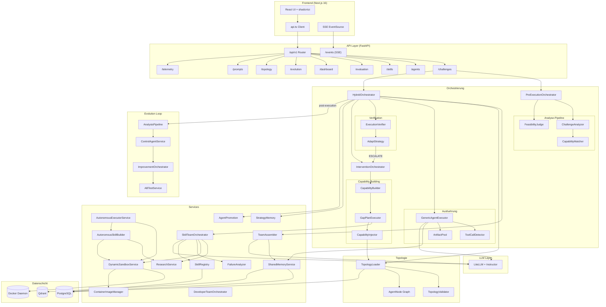
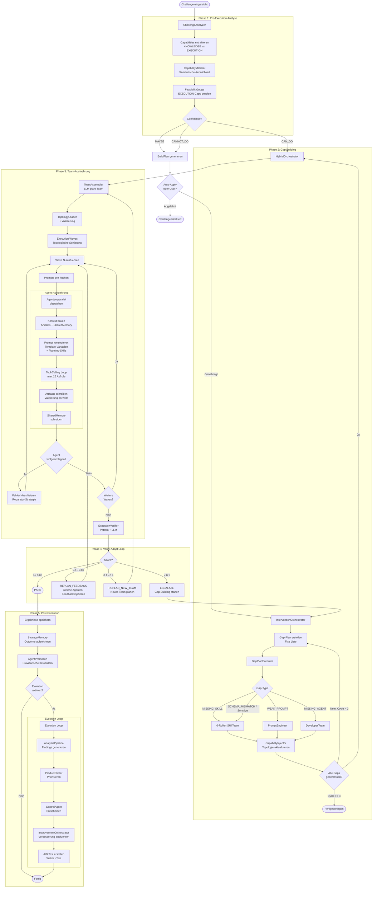
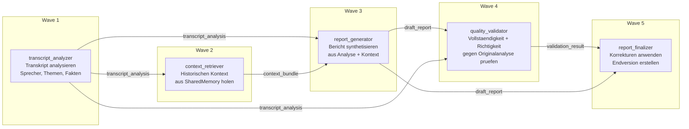
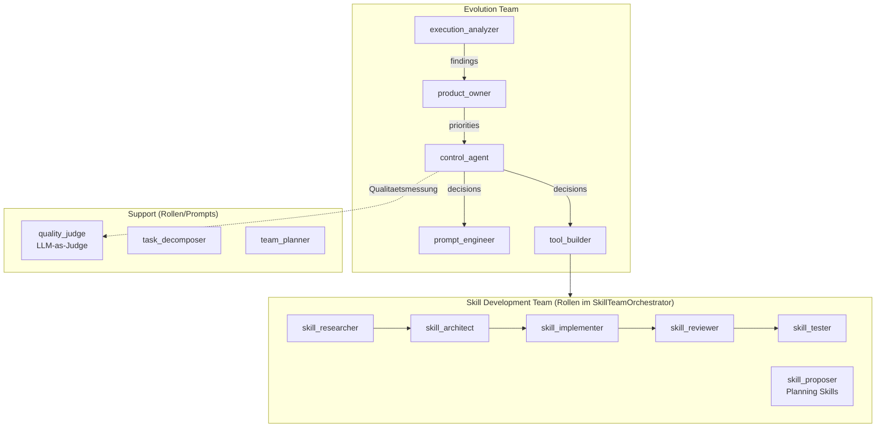
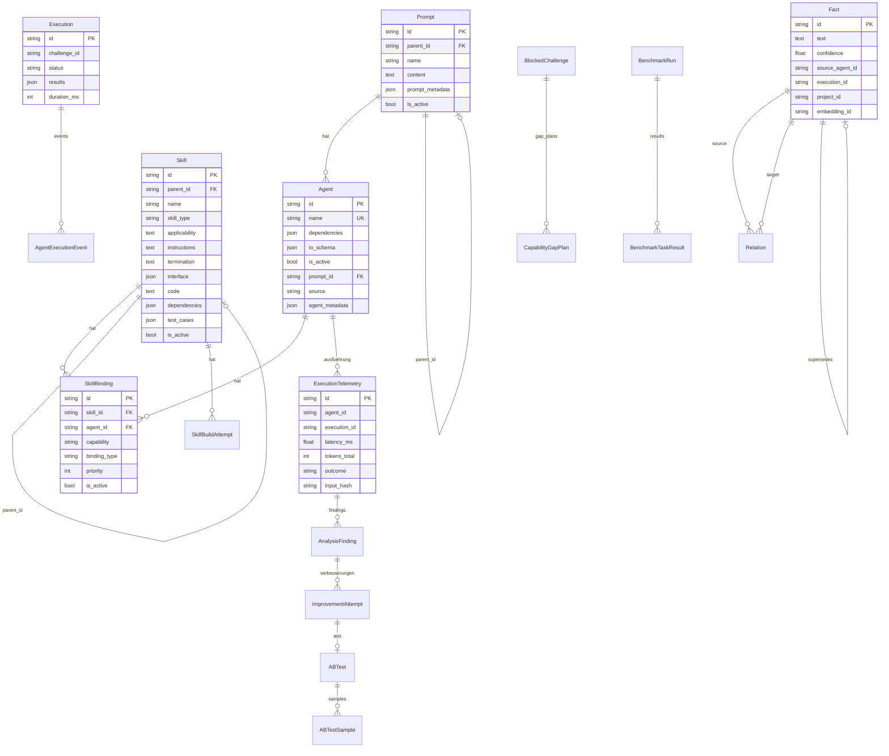
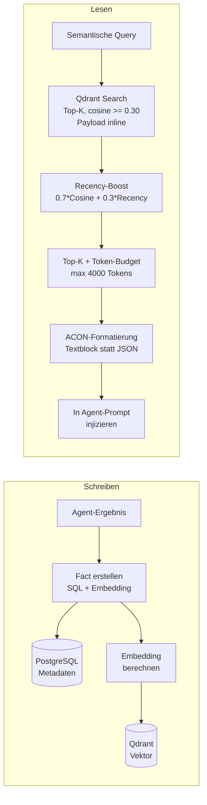
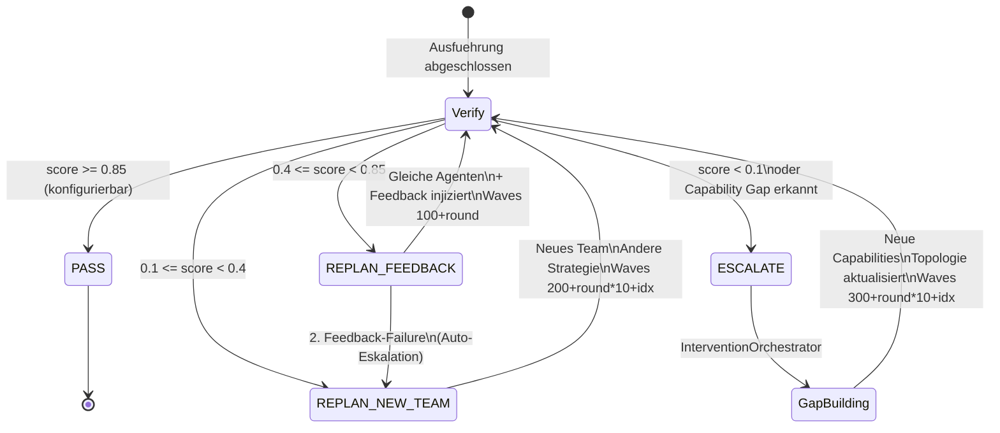
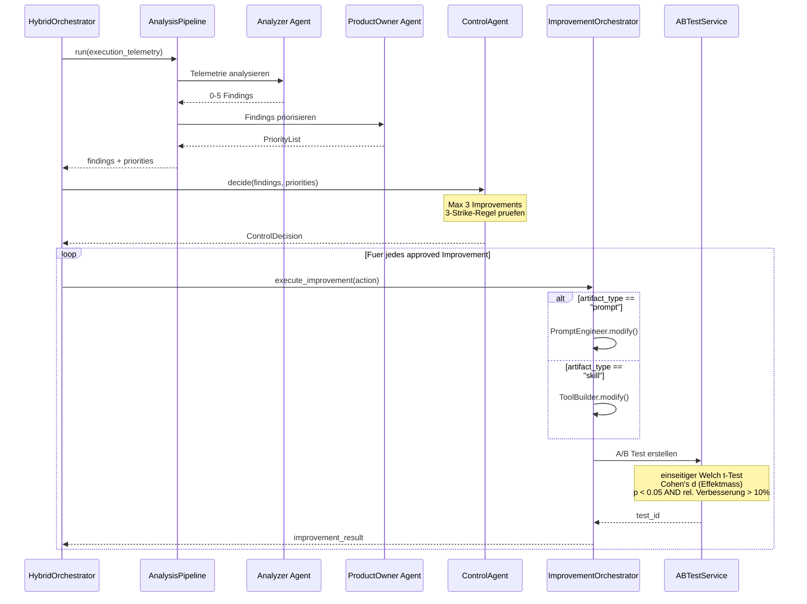
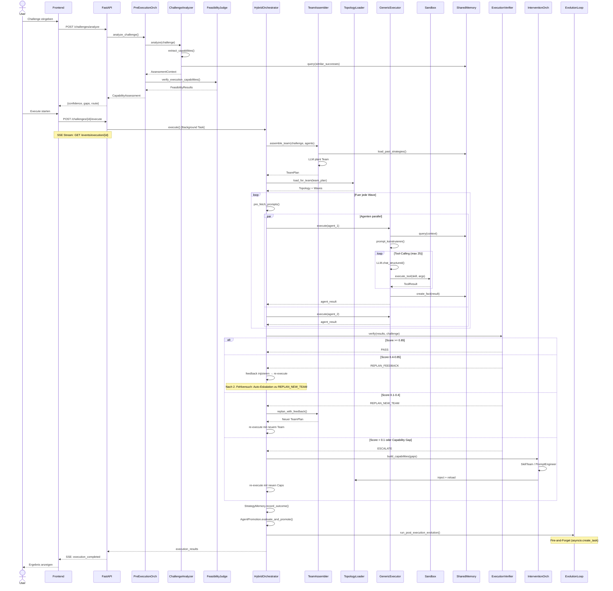

# Lumari -- Algorithmische Systemanalyse

> Stand: 2026-05-18 | Basiert auf vollstaendiger Codebase-Analyse

## Inhaltsverzeichnis

1. [Systemueberblick](#1-systemueberblick)
2. [Technologie-Stack](#2-technologie-stack)
3. [Komponenten-Diagramm (Gesamtsystem)](#3-komponenten-diagramm-gesamtsystem)
4. [Haupt-Algorithmus: Challenge-Ausfuehrung](#4-haupt-algorithmus-challenge-ausfuehrung)
   - [4.1 Ablauf-Diagramm](#41-ablauf-diagramm)
   - [4.2 Pseudocode des Haupt-Algorithmus](#42-pseudocode-des-haupt-algorithmus)
   - [4.3 Wissenschaftliche Grundlagen (Team Assembly + Execution)](#43-wissenschaftliche-grundlagen-team-assembly--execution)
5. [Skill-Entwicklungs-Algorithmus (6-Rollen-Team)](#5-skill-entwicklungs-algorithmus-6-rollen-team)
6. [Agenten-Topologie und Routing](#6-agenten-topologie-und-routing)
   - [6.1 Main Team (Report-Generierung)](#61-main-team-report-generierung)
   - [6.2 Developer Team (Selbst-Verbesserung)](#62-developer-team-selbst-verbesserung)
   - [6.3 Topologie-Management](#63-topologie-management)
7. [Datenmodell (Entity-Relationship)](#7-datenmodell-entity-relationship)
8. [SoK Skill-Modell: S = (C, pi, T, R)](#8-sok-skill-modell-s--c-pi-t-r)
9. [Shared Memory (Hybrid RAG)](#9-shared-memory-hybrid-rag)
10. [Verify-Adapt Eskalationsmodell](#10-verify-adapt-eskalationsmodell)
11. [Evolution Loop](#11-evolution-loop)
12. [API-Routing Uebersicht](#12-api-routing-uebersicht)
13. [Abstract System Tree (AST)](#13-abstract-system-tree-ast)
14. [Feature-Flags](#14-feature-flags)
15. [Wichtige Konfigurationsparameter](#15-wichtige-konfigurationsparameter)
16. [Sequenzdiagramm: Kompletter Challenge-Flow](#16-sequenzdiagramm-kompletter-challenge-flow)
17. [Glossar](#17-glossar)
18. [Wissenschaftliche Referenzen](#18-wissenschaftliche-referenzen)

---

## 1. Systemueberblick

Lumari ist ein **selbst-evolvierendes Multi-Agenten-System (MAS)** zur Generierung von Baustellenberichten aus Audio-Transkripten. Das System erkennt fehlende Faehigkeiten, baut sie autonom und verbessert sich ueber Zeit.

### Kernprinzipien

| Prinzip | Umsetzung |
|---------|-----------|
| **Autonome Evolution** | Post-Execution-Loop analysiert, priorisiert und verbessert Agenten/Skills |
| **Dynamische Team-Assembly** | LLM plant aufgabenspezifische Teams aus Agentenpool |
| **Self-Healing** | Fehler werden klassifiziert und repariert (Double-Loop, 3 Eskalationsstufen) |
| **Skill-basierte Erweiterung** | Fehlende Faehigkeiten werden durch 6-Rollen-Team autonom gebaut |
| **Shared Memory (RAG)** | Cross-Run-Lernen via PostgreSQL + Qdrant Vektordatenbank |

### Abgrenzung des Beitrags

Bestehende Systeme decken jeweils nur Teilaspekte autonomer Evolution ab:

| System | Skills | Prompts | Topologie | Shared Memory |
|--------|:------:|:-------:|:---------:|:-------------:|
| **Voyager** (arXiv:2305.16291) | ✓ (Skill-Library + Auto-Curriculum) | — | — | — |
| **GPTSwarm** (arXiv:2402.16823) | — | — | ✓ (Graph-Optimierung) | — |
| **ADAS** (arXiv:2408.08435) | — | — | ✓ (Meta-Agent Design) | Discovery-Archive |
| **PromptBreeder** (arXiv:2309.16797) | — | ✓ (Population als Baum) | — | — |
| **EvoSkill** (arXiv:2603.02766) | ✓ (Proposer/Builder) | — | — | Feedback-History |
| **Lumari** | ✓ | ✓ | ✓ | ✓ |

Lumaris Kombination aus Skill-Evolution, Prompt-Lineage, Topologie-Adaption und Shared Memory mit durchgaengiger Observability ist in der Literatur nicht als Gesamtsystem etabliert. Die Einzelmechanismen sind jeweils durch die genannten Arbeiten legitimiert — der Beitrag liegt in der Integration zu einem geschlossenen, autonomen Evolution-Zyklus.

---

## 2. Technologie-Stack

```
┌─────────────────────────────────────────────────────────┐
│                      FRONTEND                            │
│  Next.js 16 + React 19 + Tailwind v4 + shadcn/ui        │
│  TypeScript | SSE-Streaming | API-Client (api.ts)        │
└──────────────────────┬──────────────────────────────────┘
                       │ HTTP / SSE
┌──────────────────────▼──────────────────────────────────┐
│                      BACKEND                             │
│  FastAPI + Pydantic 2 + SQLAlchemy 2 (async)             │
│  Python 3.12 | asyncio | Instructor (Structured LLM)     │
│  OpenTelemetry | Rate Limiting | Security Middleware      │
└──┬──────────────┬──────────────┬────────────────────────┘
   │              │              │
   ▼              ▼              ▼
┌──────┐   ┌──────────┐   ┌──────────┐
│ LLM  │   │PostgreSQL│   │  Qdrant  │
│LiteLLM│  │ asyncpg  │   │ Vektoren │
│Gemini │  │Continuum │   │  (RAG)   │
│OpenAI │  │Versioning│   │ cosine   │
│Claude │  │          │   │ 0.30 min │
│vLLM   │  │ 20 Pool  │   │          │
│Ollama │  │ 20 Over  │   │          │
└──────┘   └──────────┘   └──────────┘
                              │
┌─────────────────────────────▼───────────────────────────┐
│                   SANDBOX                                │
│  Docker Container | 2GB RAM | 1 CPU | 600s Timeout       │
│  Netzwerk aktiv | pip/apt Installation | /data Mount      │
│  root-User (apt-get) | pip-Cache-Volume                   │
│  ContainerImageManager (Image-Caching + Prebuilds)        │
│  Sandbox-Env: lumari-postgres + lumari-qdrant Hostnamen   │
└─────────────────────────────────────────────────────────┘
```

### Technologie-Zuordnung

| Technologie | Wo eingesetzt | Zweck |
|-------------|---------------|-------|
| **LiteLLM** | `core/llm_client.py` | Provider-agnostischer LLM-Zugang |
| **Instructor** | `core/llm_client.py` | Strukturierte Pydantic-Outputs aus LLM |
| **SQLAlchemy 2** | `models/`, `repositories/` | Async ORM mit Connection Pooling |
| **SQLAlchemy-Continuum** | Prompt, Agent, Skill Modelle | Automatische Versionierung |
| **asyncpg** | `dependencies.py` | PostgreSQL async Driver |
| **Qdrant** | `SharedMemoryService` | Semantische Vektorsuche (Embeddings) |
| **sentence-transformers** | Embedding-Pipeline | Multilinguales Embedding-Modell |
| **Docker** | `DynamicSandboxService` + `ContainerImageManager` | Isolierte Code-Ausfuehrung + Image-Caching |
| **FastAPI** | `main.py`, `api/` | REST API + Background Tasks |
| **SSE** | `events/` Endpoints | Real-time Streaming zum Frontend |
| **Pydantic 2** | `models/schemas/` | Request/Response Validierung |
| **OpenTelemetry** | `main.py` | Distributed Tracing |
| **Next.js 16** | `frontend/` | React Server Components + App Router |
| **Tailwind v4** | `frontend/` | Utility-First CSS |
| **shadcn/ui** | `frontend/components/` | UI-Komponentenbibliothek |

---

## 3. Komponenten-Diagramm (Gesamtsystem)



---

## 4. Haupt-Algorithmus: Challenge-Ausfuehrung

Der zentrale Algorithmus beschreibt den vollstaendigen Weg einer Aufgabe (Challenge) durch das System.

### 4.1 Ablauf-Diagramm



### 4.2 Pseudocode des Haupt-Algorithmus

```
ALGORITHMUS: Challenge-Ausfuehrung
────────────────────────────────────────────

EINGABE: challenge_text, project_id
AUSGABE: execution_results

// ─── PHASE 1: PRE-EXECUTION ───
topology ← TopologyLoader.reload()
required_caps ← ChallengeAnalyzer.extract_capabilities(challenge_text)
  // Jede Capability wird als KNOWLEDGE oder EXECUTION klassifiziert
  // KNOWLEDGE: Reasoning, Analyse (jeder Agent kann das)
  // EXECUTION: Code, Datei-Ops (braucht Tools/Skills)

matches ← CapabilityMatcher.match(required_caps, topology.capabilities)
  // Semantische Aehnlichkeit via Embeddings

past_successes ← SharedMemory.retrieve_context(challenge_text)  // + retrieve_cross_project_context
  // Aehnliche vergangene Erfolge fuer Confidence-Boost

assessment ← build_assessment(matches, past_successes)

// Nur EXECUTION-Caps muessen auf echte Tools geprueft werden
FUER JEDE cap IN required_caps WO cap.type == EXECUTION:
    agent ← matches[cap].matched_agent
    WENN agent ist pseudo-entity (skill:xxx, prompt:xxx):
        cap.feasible ← TRUE  // Global verfuegbar
    SONST:
        skills ← topology.get_agent_skills(agent.id)
        cap.feasible ← LLM.judge(agent, skills, cap)

confidence ← calculate_confidence(assessment)
  // CAN_DO | MAYBE | CANNOT_DO

// ─── PHASE 2: GAP BUILDING (wenn noetig) ───
WENN confidence ≠ CAN_DO:
    gaps ← assessment.infeasible_capabilities
    plan ← generate_build_plan(gaps)
    
    WENN NOT auto_apply UND NOT user_approved(plan):
        RETURN blocked
    
    cycle ← 0
    SOLANGE cycle < MAX_CYCLES (3):
        FUER JEDES gap IN plan.pending_gaps:
            gap.status ← BUILDING
            FALLS gap.type:
                MISSING_SKILL → result ← SkillTeamOrchestrator.develop_skill(gap)
                WEAK_PROMPT   → result ← PromptEngineer.improve(gap)
                MISSING_AGENT → result ← DeveloperTeam.create(gap)
            
            WENN result.success:
                CapabilityInjector.inject(result.artifact, topology)
                gap.status ← COMPLETED
            SONST:
                gap.status ← FAILED
        
        TopologyLoader.reload()
        WENN alle gaps geschlossen: BREAK
        cycle += 1

// ─── PHASE 3: TEAM-AUSFUEHRUNG ───
WENN team_assembly_enabled:
    past_strategies ← StrategyMemory.load(challenge_type)
    team_plan ← TeamAssembler.assemble_team(challenge, agents, past_strategies)
      // LLM plant: welche Agenten, Abhaengigkeiten, Artifact-Flow
    
    WENN team_plan ist GapReport:
        → PHASE 2 (Gap Building)
    
    topology ← TopologyLoader.load_for_team(team_plan)
    waves ← team_plan.execution_waves
SONST:
    topology, validation ← TopologyLoader.load()
    waves ← validation.execution_waves

artifact_pool ← ArtifactPool(execution_id)
adapt_round ← 0

WIEDERHOLE:  // Verify-Adapt Loop (max MAX_ADAPT_ROUNDS=3)
    // Hinweis: Die erste Wave-Ausfuehrung laeuft im Code einmalig VOR dem Adapt-Loop;
    // der Loop umschliesst danach nur Verify + adaptive Re-Execution.
    FUER JEDE wave IN waves:
        // Prompts vorab laden (verhindert async DB-Fehler)
        prompts ← pre_fetch_prompts(wave.agents)
        
        // Agenten parallel ausfuehren
        results ← parallel_dispatch(wave.agents):
            FUER JEDEN agent:
                // Kontext aufbauen
                context ← []
                context += artifact_pool.read_for_agent(agent)
                WENN shared_memory_enabled UND agent.prompt enthält "{shared_memory}":
                    query ← build_query(agent.capabilities)
                    facts ← SharedMemory.retrieve_context(query, max_items=8, threshold=0.30, top_k=5)
                      // Score = 0.7*Cosine + 0.3*Recency-Boost; Token-Budget 4000 beim Retrieval
                    context += format_facts_as_text(facts)  // kompakter Textblock (ACON), kein JSON
                WENN agent ist entry_point (keine Dependencies):
                    context += input_data
                
                // Skills laden
                skills ← TopologyLoader.get_cached_skills(agent)
                
                // Prompt bauen (Template-Variablen ersetzen)
                prompt ← agent.prompt
                    .replace("{artifacts}", context.artifacts)
                    .replace("{shared_memory}", context.memory)
                    .replace("{input}", context.input)
                    .replace("{skills}", format_tool_descriptions(skills))
                
                // Tool-Calling Loop
                messages ← [system_prompt, user_prompt]
                tool_calls ← 0
                SOLANGE tool_calls < MAX_TOOL_CALLS (25):
                    response ← LLM.chat_structured_with_usage(messages, AgentResponse)
                      // bei Parsing-Fehler: Text-Parsing-Fallback
                    
                    WENN response.action == "final_answer":
                        BREAK → result
                    
                    WENN response.action == "tool_call":
                        skill ← find_skill(response.tool, skills)
                        WENN skill == NULL UND self_healing_enabled:
                            skill ← InterventionOrchestrator.build_on_demand(response.tool)
                        args ← validate_and_fix_args(response.arguments, skill.interface)
                        tool_result ← Sandbox.execute(skill.code, args)
                        messages += [response, tool_result]
                        tool_calls += 1
                // Limit erreicht ohne final_answer → success=FALSE, failure_type=tool_error
                
                // Ergebnisse speichern
                artifact_pool.write(agent.produces, result)  // Validierung on-write
                SharedMemory.create_fact(result, agent.id)
        
        // Self-Healing fuer fehlgeschlagene Agenten
        FUER JEDEN failure IN wave.failures:
            error_type ← classify(failure)
              // LLM_TRANSIENT, LLM_REFUSAL, ARTIFACT_VALIDATION, TOOL_ERROR
            strategy ← repair_strategy(error_type)
            retry_result ← execute_with_strategy(agent, strategy)
    
    // ─── PHASE 4: VERIFY-ADAPT ───
    WENN verify_adapt_enabled:
        verification ← ExecutionVerifier.verify(results, challenge)
          // 1. Pattern-Matching: explizite Unfaehigkeitssignale
          // 2. LLM-Evaluation: Inhalts-Vollstaendigkeit
        
        WENN verification.is_complete ODER verification.score >= 0.85:
            BREAK → PASS
        
        // Score-Stagnation: verbessert sich der Score um < 0.05 gegenueber der Vorrunde → Abbruch
        WENN adapt_round >= 1 UND (score - vorheriger_score) < 0.05:
            BREAK → best_result
        adapt_round += 1
        WENN adapt_round >= MAX_ADAPT_ROUNDS (3):
            BREAK → best_result
        
        action ← AdaptStrategy.determine(verification.score, adapt_round):
            // Thresholds konfigurierbar (Defaults):
            score >= 0.85     → PASS
            0.4 <= score < 0.85 → REPLAN_FEEDBACK
            0.1 <= score < 0.4  → REPLAN_NEW_TEAM
            score < 0.1 ODER capability_gap → ESCALATE
            // Auto-Eskalation: 2. REPLAN_FEEDBACK-Fehlversuch → REPLAN_NEW_TEAM
        
        FALLS action:
            REPLAN_FEEDBACK  → inject_feedback(verification.feedback) → WIEDERHOLE
            REPLAN_NEW_TEAM  → team_plan ← TeamAssembler.replan() → WIEDERHOLE
            ESCALATE         → build_on_demand(gaps) → Team neu planen → Waves re-execute (WIEDERHOLE)
                               // leichtgewichtiger On-Demand-Build im Adapt-Loop, kein voller Phase-2-Lifecycle
    SONST:
        BREAK

// ─── PHASE 5: POST-EXECUTION ───
WENN strategy_memory_enabled:
    StrategyMemory.record_outcome(team_plan, verification.score)
      // Erfolg (score >= 0.85) ODER Misserfolg als SharedMemory-Fact
      // Speichert: Challenge-Typ, Strategie, Team, Score, Adapt-Runden, Dauer, Tokens
      // Bei Misserfolg: Empfehlung fuer alternative Strategie

WENN agent_promotion_enabled:
    AgentPromotion.evaluate_and_promote(team_plan, verification.score)
      // Provisorische Agenten mit score >= 0.7 → permanent
      // Kriterien: Agent war provisional, hat beigetragen, Score >= min_score
      // Aktualisiert: successful_runs, total_runs, promotion_score, promoted_at

artifact_pool.clear()  // Session-only, nach Ausfuehrung weg

WENN autonomous_evolution_enabled:
    // Fire-and-Forget: laeuft im Hintergrund
    EvolutionLoop.run_post_execution_evolution(execution_id):
        findings ← AnalysisPipeline.run(execution_telemetry)
          // Analyzer → Findings → ProductOwner → Priorisierung
        
        decisions ← ControlAgent.decide(findings)
          // Max 3 Verbesserungen pro Zyklus
          // 3-Strike-Regel: gleiches Finding 3x abgelehnt → skip
        
        FUER JEDE improvement IN decisions.approved:
            FALLS improvement.artifact_type:
                "prompt" → PromptEngineer.modify(improvement)
                "skill"  → ToolBuilder.modify(improvement)
            ABTest.create(baseline, improved, metric_weights)
              // einseitiger Welch t-Test, Rollout wenn p < 0.05 AND relative Verbesserung > 10%
              // (Cohen's d wird als Effektmass mitberichtet, ist aber nicht das Rollout-Kriterium)

RETURN execution_results
```

### 4.3 Wissenschaftliche Grundlagen (Team Assembly + Execution)

| Entscheidung | Begruendung | Quelle |
|---|---|---|
| **LLM-basierte Team-Planung** (Planner plant, Developer Team baut) | Strikte Trennung zwischen read-only Planung und Ausfuehrung — Planner waehlt aus bestehendem Agent-Pool, erstellt/aendert keine Agents selbst. Reduziert Halluzinations-Risiko und ermoeglicht unabhaengige Validierung | AgentOrchestra (2025), InfiAgent (2025) |
| **Plan-Validierung** (Solvability, Completeness) | Geplantes Team wird VOR Ausfuehrung auf Loesbarkeit geprueft — existieren alle Agents im Pool, sind Dependencies aufloesbar, ist ein Ergebnis-Produzent vorhanden | Agent-Oriented Planning (ICLR 2025) |
| **Team-Groesse max 6-8 Agents** (Validator-Grenze) | Zu grosse Teams erzeugen Negativ-Returns durch Coordination-Overhead — kleiner ist besser. Der Planner-Prompt fordert die "richtige Teamgroesse" (nicht kuenstlich klein, nicht unnoetig gross), der PlanValidator markiert Teams mit >8 Agents als Issue | Towards a Science of Scaling Agent Systems (DeepMind, 2025) |
| **Cross-Run Strategy Learning** (StrategyMemory speichert Outcomes als Facts) | Erfolge und Misserfolge vergangener Executions informieren zukuenftige Team-Planung — Planner vermeidet gescheiterte Strategien und bevorzugt bewaehrte Team-Kompositionen fuer aehnliche Challenge-Typen | LATS (arXiv:2310.04406), Voyager (arXiv:2305.16291) |
| **Intra-Agent Reflection** (Selbst-Evaluation nach jedem Tool-Call) | Agents pruefen nach jedem Tool-Ergebnis ob ihre bisherigen Daten ausreichen und passen den naechsten Query gezielt an — verhindert vorzeitige Antworten mit unvollstaendigen Daten | Reflexion (NeurIPS 2023) |

---

## 5. Skill-Entwicklungs-Algorithmus (6-Rollen-Team)

```mermaid
flowchart TD
    Start([Skill-Anforderung]) --> SkillType{Skill-Typ?}
    
    SkillType -->|functional| History[FailureAnalyzer<br/>Vergangene Fehler laden]
    SkillType -->|planning| Proposer[PROPOSER<br/>Brainstorm 3+ Ansaetze<br/>Reasoning-Anweisungen erstellen]
    
    Proposer --> PlanPersist[Planning-Skill persistieren<br/>Kein Code, nur Instructions]
    PlanPersist --> Done([Skill aktiv])
    
    History --> Research[RESEARCHER<br/>Pakete + Ansaetze recherchieren]
    Research --> Architecture[ARCHITECT<br/>API + Tests + Dependencies designen]
    
    Architecture --> ImplStart[IMPLEMENTER<br/>Code schreiben]
    
    subgraph DoubleLoop["Double-Loop Self-Healing"]
        ImplStart --> Test{Test in<br/>Sandbox}
        Test -->|Bestanden| Review
        Test -->|Fehlgeschlagen| Classify[Fehler klassifizieren]
        Classify --> Route{Fehler-Typ?}
        Route -->|IMPORT_ERROR| AltPkg[Alternative Pakete<br/>DEBUG_IMPORT_PROMPT]
        Route -->|STRUCTURE_ERROR| Rewrite[Code umschreiben<br/>DEBUG_STRUCTURE_PROMPT]
        Route -->|LOGIC_ERROR| Restructure[Ansatz aendern<br/>DEBUG_LOGIC_PROMPT]
        AltPkg & Rewrite & Restructure --> LibSwitch{3x gleiche<br/>Library fehlgeschlagen?}
        LibSwitch -->|Ja| AltLib[Approach-Switch<br/>schlechte Library aus pip entfernen<br/>+ LLM-Debug]
        LibSwitch -->|Nein| Iter{Iteration<br/>< 10?}
        AltLib --> Iter
        Iter -->|Ja| Test
        Iter -->|Nein, Oszilliert nach 5| Regen[Komplett-Regenerierung]
        Regen --> Test
        Iter -->|Nein, Max erreicht| Fail([Fehlgeschlagen])
    end
    
    Review[REVIEWER<br/>Qualitaet + Sicherheit<br/>interne Revision max 2] --> ReviewOK{Approved?}
    ReviewOK -->|Nein| Fail
    ReviewOK -->|Ja| TestPhase[TESTER<br/>voller Sandbox-Lauf]
    TestPhase -->|Fehlgeschlagen| Fail
    TestPhase -->|Bestanden| Semantic{Semantische<br/>Validierung? opt-in}
    
    Semantic -->|Bestanden / uebersprungen| Alignment{Code-Alignment?<br/>RQ3, opt-in}
    Semantic -->|Nicht bestanden| Fail
    Alignment -->|OK / uebersprungen| Regression[Parent-Regression<br/>Check]
    Alignment -->|Nicht bestanden| Fail
    
    Regression --> Persist[Skill persistieren<br/>+ Hot-Reload reload_skill<br/>+ Skill-Directory Export]
    Persist --> Done
    Persist -.->|nachgelagert im CapabilityBuilder| Bind[SkillBinding an Agent<br/>via Affinity-Score]
```



### Pseudocode: SkillTeamOrchestrator

```
ALGORITHMUS: Skill-Entwicklung
────────────────────────────────

EINGABE: capability_name, challenge_context, failure_history
AUSGABE: SkillBuildResult

// ─── SONDERFALL: PLANNING SKILL ───
WENN skill_type == "planning":
    // PROPOSER-Rolle: Erstellt Reasoning-Anweisungen (kein Code)
    planning_skill ← Proposer.propose(capability_name, context)
      // EvoSkill-Pattern (Prompt-Anweisung, ein LLM-Call): Ansaetze abwaegen, besten waehlen
      // Output: name, applicability, instructions, termination
    persist_planning_skill(planning_skill)
    RETURN SkillBuildResult(success=TRUE, skill_type="planning")

// ─── FUNCTIONAL SKILL: 6-Phasen Pipeline ───

// Phase 1: Recherche
failures ← FailureAnalyzer.get_history(capability_name)
research ← Researcher.research(capability_name, failures)
  // pip-Pakete, system-Pakete, Code-Beispiele, Ansaetze
  // Nutzt CAPABILITY_PACKAGE_HINTS (20+ Domaen-Mappings)

// Phase 2: Architektur
design ← Architect.design(capability_name, research)
  // function_signature: "def execute(input_data: dict) -> dict"
  // input_schema, output_schema (JSONSchema)
  // test_cases, integration_plan (Ziel-Agent)

// Phase 3: Implementierung (Self-Healing Double-Loop)
// Beide Schleifen teilen EIN gemeinsames Iterationsbudget (max_implementation_iterations=10);
// es gibt keinen separaten Session-Cap. Die aeussere Schleife oeffnet bei neuen Paketen bzw.
// erzwungener Regenerierung eine neue Sandbox-Session, zaehlt aber denselben iteration-Counter weiter.
code ← NULL
iteration ← 0
error_history ← []
SOLANGE iteration < MAX_ITERATIONS (10):        // aeussere Schleife = neue Sandbox-Session
    ÖFFNE Sandbox-Session(current_pip, current_apt)
    SOLANGE iteration < MAX_ITERATIONS (10):    // innere Schleife = Debug-Zyklen in derselben Session
        WENN code == NULL:
            code ← Implementer.write(design, failures)
        
        // Statische Validierung VOR dem Test: Struktur (execute-Signatur) + Hardcoded-Pfade
        WENN NICHT valid_structure(code) ODER hardcoded_paths(code):
            code ← rewrite(code)  // STRUCTURE_ERROR wird hier frueh abgefangen, nicht erst im Test
            iteration += 1; CONTINUE
        
        // Proaktiver Import-Scan → neue Pakete brechen die Session ab und oeffnen eine neue
        missing_pkgs ← scan_imports(code)
        WENN missing_pkgs: current_pip += missing_pkgs; BREAK → neue Session
        
        test_result ← Sandbox.execute(code, design.test_cases, test_input)
        WENN test_result.success:
            BREAK → review_phase
        
        error_type ← FailureAnalyzer.classify(test_result.error)
        error_history.append(error_type)
        
        // Oszillations-Erkennung (>=3 verschiedene Error-Typen in den letzten 5 Iterationen)
        WENN iteration >= 5 UND errors_oscillating(error_history):
            code ← NULL  // erzwingt Komplett-Neugenerierung in der naechsten Iteration
        
        // Error-Type-Routing (typisierte Debug-Prompts)
        FALLS error_type:
            IMPORT_ERROR → in-session pip install / alternatives Paket (DEBUG_IMPORT_PROMPT)
            LOGIC_ERROR / RUNTIME_ERROR → code ← debug_code(code, design)  (DEBUG_LOGIC_PROMPT)
        
        // Approach-Switch nach 3 Fehlversuchen mit gleicher Bibliothek (_should_switch_approach)
        WENN same_library_failed >= 3:
            code ← debug_code(...)                       // LLM waehlt neuen Ansatz/Library
            current_pip ← current_pip OHNE bad_library   // problematische Library aus pip entfernen
              // Hinweis: das kuratierte Alternativen-Mapping (torch→onnxruntime, pandas→polars,
              //   whisper→faster-whisper, PIL→pillow ...) lebt im AutonomousSkillBuilder
              //   (_LIBRARY_ALTERNATIVES), NICHT im SkillTeamOrchestrator.
        
        iteration += 1

// Phase 4: Review (interne Revisions-Schleife, max_review_iterations=2)
FÜR review_iter IN 1..max_review_iterations:
    review ← Reviewer.review(code, design)
    WENN review.approved: BREAK
    code ← Revision.fix(code, review.findings)   // bricht die Revision den Code → Revert + approved
WENN NICHT review.approved: RETURN failure(REVIEWER)   // KEIN Ruecksprung zur Implementation

// Phase 4b: Test (TESTER-Rolle) — voller Sandbox-Lauf nach dem Review
test_result ← Tester.run(code, design.test_cases, test_input)
WENN NICHT test_result.success: RETURN failure(TESTER)

// Phase 5: Semantische Validierung (opt-in)
WENN require_semantic_validation UND expected_output IS NOT NULL:
    validation ← SemanticValidator.validate(test_output, expected_output)
    WENN validation.similarity < threshold (0.7):
        RETURN failure(TESTER, SEMANTIC_ERROR)   // KEIN Ruecksprung zur Implementation

// Phase 5b: Code-Description-Alignment (RQ3, opt-in)
WENN code_alignment_enabled UND require_alignment_validation:
    alignment ← AlignmentValidator.validate(description=capability_name, code)
    WENN NICHT alignment.is_aligned: RETURN failure(TESTER, SEMANTIC_ERROR)

// Phase 6: Parent-Regression + Persistierung
WENN design.parent_skill EXISTS:
    activation ← SkillValidator.validate_for_activation(candidate)
    WENN NICHT activation.approved: RETURN failure

skill ← persist_skill(code, design, test_cases)
WENN hot_reload_enabled:
    SkillRegistry.get_instance().reload_skill(skill)  // via _hot_reload_skill(), sofort verfuegbar
FailureAnalyzer.learn_from_success(capability_name)   // + record_attempt(success=TRUE)
// Hinweis: Die SkillBinding an einen Agenten erfolgt NICHT hier, sondern nachgelagert im
// CapabilityBuilder (_bind_skill_to_agent / expand_or_create): ein Agent-Affinity-Score
// entscheidet zwischen Bestandsagent erweitern und neuem Spezialisten. design.target_agent
// ist dabei nur ein Vorschlag.

WENN skill_directory_enabled:
    save_skill_directory(skill)
      // Exportiert: SKILL.md, scripts/main.py, requirements.txt, tests/

RETURN SkillBuildResult(success=TRUE, skill_id=skill.id)
```

### Test-Kontext und Infrastruktur-Injektion (Stand 2026-05-29)

Bei DB-Benchmark-Tasks blieb `built_capability_ids` leer: Skills wurden gebaut, aber gegen die falsche Datenbank getestet und scheiterten still. Vier Fixes:

- **Test-Kontext aus Challenge-Text extrahieren** (`orchestration/intervention/capability_builder.py`, `_extract_test_context()`): Parst `Host:…`, `Port:…`, `User:…`, `Passwort:…`, `DB:…`-Muster aus dem Challenge-Text und baut daraus eine `database_url`, die als `test_input` in den Build geht. Vorher hatte der Tester keine Verbindungsdaten zur Ziel-DB.
- **Infrastruktur-Injektion mit Guard** (`skills/building/team_orchestrator.py`, `_inject_infrastructure_values()`): Ein `_KNOWN_SANDBOX_HOSTS`-Guard ueberspringt Werte, die bereits `benchmark-db`, `lumari-postgres` oder `lumari-qdrant` enthalten. Vorher ueberschrieb die Injektion **jede** `database_url` blind mit `lumari-postgres` — und zerstoerte damit die aus dem Challenge-Text extrahierten Benchmark-Verbindungsdaten.
- **Caller-Input gewinnt im Merge** (`_build_test_code()`): Caller-`test_input` ueberschreibt jetzt die Architect-Test-Cases (vorher umgekehrt) — die echten Task-Daten haben Vorrang vor den synthetischen Architect-Beispielen.
- **`test_input` durchgereicht** (`_implementation_phase()`): Der Parameter wird jetzt bis in die Implementierungs-/Validierungsphase weitergegeben, statt unterwegs verloren zu gehen.

**Code-Description-Alignment-Validierung (RQ3) temporaer deaktiviert:** Der neue `skills/testing/code_alignment_validator.py` rekonstruiert eine Spezifikation aus dem Code und vergleicht sie semantisch mit der Skill-Beschreibung (Gatekeeper-Idee aus RQ3). Wegen False Positives ist `require_alignment_validation` (in `models/schemas/skill_build_schemas.py`) auf `default=False` gesetzt — der Validator laeuft nur, wenn `code_alignment_enabled` UND `require_alignment_validation` gesetzt sind (siehe `team_orchestrator.py` Phase Review).

### Wissenschaftliche Grundlagen (Skill-Entwicklung)

| Entscheidung | Begruendung | Quelle |
|---|---|---|
| **Feedback-History (append-only)** pro Skill-Build | EvoSkill-Pattern: Jeder Build-Versuch wird mit Strategie, Fehler-Typ, Lesson-Learned protokolliert. Neue Builds lesen die vollstaendige History und vermeiden bereits gescheiterte Ansaetze. Verhindert endlose Wiederholung gleicher Fehler | EvoSkill (arXiv:2603.02766) |
| **Error-Type-Aware Debugging** (typisierte Debug-Prompts statt generischem Retry) | CASCADE zeigt hoehere Robustheit durch fehlertyp-spezifische Reparatur-Strategien. IMPORT_ERROR → Package-Alternative, STRUCTURE_ERROR → AST-Fix, LOGIC_ERROR → Ansatz aendern. Routing deckt 80% des Nutzens ab, Parallelisierung als spaetere Optimierung | CASCADE (arXiv:2512.23880) |
| **Proposer/Builder-Trennung** (Planning-Skills vs. Functional-Skills getrennt erstellen) | EvoSkill trennt Skill-Discovery (Proposer) von Skill-Implementation (Builder). Planning-Skills brauchen keinen Code-Build, sondern Brainstorming ueber Reasoning-Strategien | EvoSkill (arXiv:2603.02766) |
| **Double-Loop Self-Healing** (Innere Debug-Cycles + Aeussere Session-Restarts) | Innere Schleife iteriert fehlertypbasiert, aeussere Schleife startet bei Oszillation komplett neu (Regenerierung). Verhindert Festfahren in lokalen Optima | CASCADE (arXiv:2512.23880), SkillWeaver (arXiv:2504.07079) |
| **Library-Alternative nach 3 Fehlversuchen** | Wenn gleiche Bibliothek wiederholt scheitert (z.B. Installations-Probleme in Sandbox), automatischer Wechsel zu leichtgewichtiger Alternative (torch→onnxruntime, pandas→polars). Reduziert Abhaengigkeit von problematischen Paketen | Eigene Heuristik, inspiriert durch CASCADE |
| **Konfigurierbares Modell pro Rolle** (Researcher, Architect, Implementer, Reviewer) | Code-Generierung braucht staerkeres Modell als Recherche. Per-Rolle-Modellwahl via LiteLLM ermoeglicht Kosten-Qualitaets-Optimierung — z.B. starkes Modell nur fuer Implementer, guenstiges fuer Researcher | ToolMaker (arXiv:2502.11705): 80% Baseline mit starkem Modell |
| **Intra-Execution Self-Healing** (On-Demand Skill-Building waehrend Execution) | Pre-Execution Gap-Detection ist Approximation ("was wird wohl fehlen?"), Intra-Execution ist Ground Truth ("ich brauche gerade dieses Tool"). Beide Ansaetze ergaenzen sich: Pre-Execution ist guenstiger (Fehler vermeiden), Intra-Execution faengt Restuecken auf | SkillWeaver (arXiv:2504.07079), CASCADE (arXiv:2512.23880) |
| **Topology-Integration-Protokoll** (Architect definiert target_agent + Artifacts) | Ohne explizites Protokoll werden Skills gebaut aber nie korrekt integriert — wer entscheidet welcher Agent den Skill bekommt? Der Architect definiert als Teil des Outputs: target_agent_id, artifact_declarations, optional dependency_changes | Eigene Architektur-Entscheidung, adressiert beobachtetes Integrations-Problem |
| **Maker/User-Architektur** (teurer SkillTeamOrchestrator vs. guenstiger GenericExecutor) | LATM's Zweistufige Architektur: ein starkes Modell erstellt Tools einmalig (Maker-Phase), ein guenstigeres Modell nutzt sie wiederholt (User-Phase). Der SkillTeamOrchestrator (6 Rollen, starke Modelle) ist der Maker, der GenericAgentExecutor der User. Amortisiert hohe Build-Kosten ueber wiederholte Nutzung — direkt relevant fuer RQ2 (Ressourcenreduktion durch Wiederverwendung) | LATM (Cai et al. 2023, arXiv:2305.17126) |

---

## 6. Agenten-Topologie und Routing

### 6.1 Main Team (Report-Generierung)



### 6.2 Developer Team (Selbst-Verbesserung)



> **Hinweis:** Echte YAML-Agenten des Developer-Teams sind ausschliesslich `control_agent`, `execution_analyzer`, `product_owner`, `prompt_engineer`, `quality_judge` und `tool_builder` (`config/agents/`, `team: developer_team`). Die Knoten des *Skill Development Teams* (`skill_researcher`, `skill_architect`, `skill_implementer`, `skill_reviewer`, `skill_tester`, `skill_proposer`) sind **Rollen/Prompts** innerhalb des `SkillTeamOrchestrator`; `task_decomposer` und `team_planner` sind Prompt-Konzepte im `TeamAssembler` — keine eigenstaendigen Agenten in der Topologie.

### 6.3 Topologie-Management

```
TopologyLoader.load()
├── TopologyRepository.get_agents_with_prompts()
├── Fuer jeden Agent:
│   ├── Capabilities aus Agent.io_schema extrahieren
│   ├── Skills binden (Prioritaet):
│   │   1. skill.applicability (SoK C-Feld)
│   │   2. skill_metadata.affected_capability (Legacy)
│   │   3. skill.name abgeleitet (Fallback)
│   ├── Skill-Binding-Logik:
│   │   WENN skill.target_agent_id existiert:
│   │       NUR an diesen Agent binden
│   │   SONST:
│   │       Global fuer alle Agenten verfuegbar
│   └── AgentNode erstellen
├── Dependencies aufloesen (Name → ID)
├── TopologyValidator.validate()
│   ├── Zyklen-Erkennung (DAG-Pruefung)
│   ├── Topologische Sortierung → execution_order
│   └── Parallele Gruppierung → execution_waves
└── Cache aktualisieren (Reload nur zwischen Runs)
```

---

## 7. Datenmodell (Entity-Relationship)



---

## 8. SoK Skill-Modell: S = (C, pi, T, R)

Das Skill-Modell basiert auf der formalen Definition aus der State of Knowledge (SoK) Literatur:

```
S = (C, π, T, R)

C = Applicability Condition  → WANN soll der Skill eingesetzt werden?
    Beispiel: "Wenn ein Audio-Transkript in Text umgewandelt werden muss"

π = Instructions (Policy)    → WIE soll der Skill ausgefuehrt werden?
    Beispiel: "Verwende faster-whisper fuer lokale Transkription"

T = Termination Condition    → WANN ist der Skill fertig?
    Beispiel: "Wenn das Transkript vollstaendig als Text vorliegt"

R = Interface (Resources)    → WAS nimmt der Skill entgegen / gibt er zurueck?
    input_schema:  {"audio_path": "string"}
    output_schema: {"transcript": "string", "confidence": "number"}
```

### Zwei Skill-Typen

| Typ | Beschreibung | Code | Ausfuehrung | Erstellt von |
|-----|-------------|------|-------------|-------------|
| **functional** | Ausfuehrbarer Python-Code | `def execute(input_data: dict) -> dict` | Docker Sandbox | Researcher → Architect → Implementer → Reviewer → Tester |
| **planning** | Reasoning-Anweisungen | NULL | Als Kontext in Agent-Prompt injiziert | PROPOSER (EvoSkill-Pattern, Brainstorm 3+ Ansaetze) |

### Design-Entscheidungen und Begruendungen (Skill-Modell)

| Entscheidung | Begruendung | Alternative (verworfen) | Quelle |
|---|---|---|---|
| **SoK-konformes Skill-Modell S=(C,pi,T,R)** | Formale Grundlage aus der Agentic-Skills-Literatur — jeder Skill hat explizite Applicability, Policy, Termination und Interface. Zitierbar und begruendbar im akademischen Kontext | Ad-hoc Felder (nicht formal begruendbar) | SoK: Agentic Skills (arXiv:2602.20867, Feb 2026) |
| **Zwei Skill-Typen (Planning + Functional)** statt flaches Modell | SkillX zeigt: ein hierarchisches Modell (Planning → Functional → Atomic) schlaegt ein flaches Modell um ~10 Punkte. Lumari uebernimmt die oberen zwei Level — Reasoning-Gaps koennen nicht als Code geloest werden, sondern benoetigen Anweisungen im System-Prompt | Nur Functional (wie in frueheren Versionen) | SkillX (arXiv:2604.04804, Apr 2026) |
| **Skills als Capabilities** (statt separate capabilities-Liste auf Agent) | Single Source of Truth — `Skill.applicability` wird beim Build definiert und ist kausal mit dem Code verknuepft. Keine manuell gepflegte, veraltete String-Liste mehr, keine semantische Divergenz zwischen Claim und Realitaet moeglich | `Agent.capabilities` beibehalten + synchron halten (fragil, war bereits divergent) | Eigene Architektur-Entscheidung, motiviert durch beobachtete Divergenz im Vorgaengersystem |
| **Gap-Typ-Klassifikation** (Planning-Gap vs. Functional-Gap vs. Agent-Gap) | Verschiedene Gap-Typen erfordern verschiedene Build-Pfade — ein Planning-Gap braucht Reasoning-Anweisungen (Proposer), ein Functional-Gap braucht Code (6-Rollen-Team), ein Agent-Gap braucht einen neuen Agenten (DeveloperTeam) | Einheitlicher Build-Pfad fuer alle Gaps | SoK (arXiv:2602.20867), SkillX (arXiv:2604.04804) |

---

## 9. Shared Memory (Hybrid RAG)



### Konfiguration

| Parameter | Wert | Beschreibung |
|-----------|------|-------------|
| `shared_memory_max_items` | 8 | Max Qdrant-Ergebnisse |
| `shared_memory_max_tokens` | 4000 | Max Token pro Memory-Block |
| `shared_memory_top_k` | 5 | Top-K Filter pro Agent |
| `shared_memory_score_threshold` | 0.30 | Min cosine Aehnlichkeit |
| `embed_model_name` | `paraphrase-multilingual-MiniLM-L12-v2` | Multilinguales Modell |

### Design-Entscheidungen und Begruendungen

#### Verbindung zu RQ2

RQ2 fragt, ob die Wiederverwendung autonom generierter Blueprints den Ressourcenverbrauch reduziert. Der **primaere Mechanismus** ist Skill-Reuse (eliminiert die Build-Phase: ~240s und ~1M Tokens pro Skill). Der **sekundaere Beitrag** ist die Memory-Injection-Optimierung: Ohne Optimierung erhoehte SharedMemory den Token-Verbrauch um +10.8% gegenueber Cold-Start (Benchmark 2026-04-27) — die Hypothese H2 war damit zunaechst widerlegt. Durch die unten beschriebenen Massnahmen sank der Gesamt-Token-Verbrauch um −49.7% (2.36M → 1.19M Tokens), bei gleichzeitig stabilem Pass@1 von 60.0%.

#### Begruendungs-Kette pro Design-Entscheidung

| Entscheidung | Begruendung | Quelle |
|---|---|---|
| **Score-Threshold 0.30** | Naives Memory ohne Relevanz-Filter schadet der Ausfuehrungsqualitaet — niedrig-scorende Facts fuegen Rauschen hinzu | G-Memory (NeurIPS 2025) |
| **ACON-Kompression** (Text statt Pretty-JSON) | Kontext-Kompression spart 26-54% Tokens bei gleichbleibender LLM-Verstaendlichkeit. Facts werden als einzeilige Textbloecke mit Score-Annotation formatiert statt als `indent=2` JSON | ACON (arXiv:2510.00615) |
| **Niedrige Limits** (8 Items, 5 Top-K, 4000 Tokens) | Masking (irrelevante Informationen weglassen) ist mindestens so effektiv wie Summarization — weniger aber relevantere Facts uebertreffen viele zufaellige | Complexity Trap (arXiv:2508.21433) |
| **Entry-Point-Only** (nur Agents mit `{shared_memory}` im Prompt) | Per-Agent-Relevanz schlaegt Broadcast: Downstream-Agents erhalten bereits verarbeitete Artifacts vom Vorgaenger, Cross-Execution-Wissen ist dort redundant. Nur der Entry-Point-Agent (`transcript_analyzer`, Wave 1) benoetigt historischen Kontext | IMA (arXiv:2508.08997) |
| **Agent-spezifische Query** (Rolle + Artifact-Inhalt statt generischer Name) | Semantische Suche per Rollenbeschreibung und aktuellem Aufgabenkontext liefert relevantere Facts als eine generische Query wie `"Context for {agent_name} agent"` | Voyager (arXiv:2305.16291) |
| **Cross-Run Strategy Learning** (Outcomes als Facts persistiert) | Erfolge und Misserfolge vergangener Team-Strategien werden als SharedMemory-Facts gespeichert — der TeamAssembler nutzt diese Erfahrungen um bewaehrte Strategien zu bevorzugen und gescheiterte zu vermeiden | LATS (arXiv:2310.04406) |
| **Recency-Boost** (0.7*Cosine + 0.3*Recency) | Der Score-Threshold 0.30 filtert auf die rohe Cosine-Similarity; die finale Sortierung/Anzeige nutzt einen kombinierten Score mit exponentiellem Recency-Decay (Halbwertsskala ~1 Woche) — juengere Facts werden bei gleicher Relevanz bevorzugt | Eigene Methodik |

#### Verworfene Alternative: G-Memory-Hierarchie

Eine hierarchische 3-Layer-Graph-Struktur mit Backward Propagation, Fact-Promotion (`blueprint → principle`) und automatischem Pruning wurde evaluiert und bewusst verworfen:

- **Token-neutral:** Die Hierarchie verbessert Fact-*Qualitaet*, adressiert aber nicht das Token-Reduktionsziel (RQ2)
- **Daten-Mangel:** Backward Propagation benoetigt Nutzungs-Statistiken, die im 30-Task-Benchmark nicht ausreichend anfallen
- **Statistisch nicht belegbar:** Die Promotion-Schwelle (5 Nutzungen) wird bei 30 Tasks kaum erreicht — kein thesisrelevanter Nachweis moeglich
- **Komplexitaet:** ~600 Zeilen neuer Code fuer ein Feature, das im Benchmark nicht zuendet

Die einfachen Massnahmen (Score-Filter, ACON-Kompression, Entry-Point-Only) reichen aus, um RQ2 zu stuetzen. Die G-Memory-Hierarchie bleibt als Future Work fuer groessere Benchmarks (≥100 Tasks).

Quellen: G-Memory (NeurIPS 2025), EvolveR (arXiv:2510.16079), EvoSkill (arXiv:2603.02766)

---

## 10. Verify-Adapt Eskalationsmodell



### Design-Entscheidungen und Begruendungen

| Entscheidung | Begruendung | Quelle |
|---|---|---|
| **Plan-Execute-Verify-Replan Zyklus** | Verification nach Execution mit adaptiver Replanning-Strategie statt blindem Retry — erkennt ob der Ansatz grundsaetzlich falsch war oder nur unvollstaendig | VMAO (arXiv:2603.11445) |
| **Capability-Gap-Erkennung** (11 Patterns, DE + EN) | Explizite Unfaehigkeits-Signale im Output erkennen und von unvollstaendigen Antworten unterscheiden — basierend auf Failure Taxonomy mit 14 Fehlermodi in Multi-Agenten-Systemen | MAST (arXiv:2503.13657) |
| **Feedback als typisiertes Artifact** (verification_feedback) | Verification-Feedback wird als Artifact in den ArtifactPool geschrieben statt als Prompt-Injection — Agents konsumieren es wie jedes andere Artifact, gleicher Mechanismus fuer alle Datentypen | Reflexion (NeurIPS 2023) |
| **Score-basierte 3-Stufen-Eskalation** (konfigurierbare Schwellwerte) | Verschiedene Score-Bereiche triggern unterschiedlich teure Reparatur-Strategien — REPLAN_FEEDBACK ist guenstig (gleiche Agents), REPLAN_NEW_TEAM mittel (neuer Plan), ESCALATE teuer (Gap-Building). Proportionale Reaktion statt einheitlichem Retry | Adaptive Multi-Agent Systems (2024) |
| **Auto-Eskalation nach 2. Feedback-Failure** | Verhindert endlose Feedback-Loops — wenn gleicher Ansatz zweimal scheitert (`replan_round >= 1`), wird der Ansatz gewechselt (REPLAN_NEW_TEAM) statt weiter optimiert | VMAO (arXiv:2603.11445) |
| **Score-Stagnations-Abbruch** (Delta < 0.05) und **max_adapt_rounds = 3** | Der Adapt-Loop bricht zusaetzlich ab, wenn sich der Score zwischen zwei Runden um weniger als 0.05 verbessert, und ist hart auf 3 Runden begrenzt — verhindert Ressourcenverschwendung bei nicht-konvergierenden Reparaturen | Eigene Methodik |

---

## 11. Evolution Loop



### Trigger und Eingaben (Stand 2026-05-30)

Drei Fixes haben den Loop von "effektiv deaktiviert" auf "feuert zuverlaessig" gebracht:

- **Trigger feuert bei `success` UND `failed`** (`core/telemetry.py`): Die Completion-Callback-Bedingung war zuvor auf `outcome == "success"` beschraenkt — der Loop wurde bei Fehlern, also genau dann wenn Self-Healing gebraucht wird, nie ausgeloest. Bedingung ist jetzt `outcome in ("success", "failed")`.
- **Failed Tool-Calls erreichen den Loop** (`orchestration/orchestrators/hybrid_orchestrator.py`): `_collect_failed_tool_calls()` sammelt fehlgeschlagene Tool-Aufrufe (z.B. SQL-Errors) aus den Wave-Results und reicht sie als `output_content` an `run_post_execution_evolution()` (`feedback_loop/loop.py`) weiter. Vorher gingen Tool-Call-Fehler verloren, weil nur die Telemetrie analysiert wurde.
- **Analyzer parst robust via Instructor** (`feedback_loop/analysis/analyzer.py`): Manuelles `response_format` + `model_validate_json()` scheiterte an Markdown-Wrappern (```` ```json ````), die Gemini um die JSON-Antwort legt. Ersetzt durch `self.llm.chat_structured(response_model=AnalysisResult)` — Instructor uebernimmt Extraktion und Validierung.

### Wissenschaftliche Grundlagen (Evolution Loop)

| Entscheidung | Begruendung | Quelle |
|---|---|---|
| **Fire-and-Forget Background Task** (asyncio.create_task statt Worker/Queue) | Minimal-invasiv, keine neue Infrastruktur (Redis/Celery). DSPy's compile()-Pattern triggert ebenfalls synchron nach Metrik-Evaluation — gleiche Philosophie. Exception-Logging via add_done_callback verhindert Silent-Failures | DSPy/MIPROv2 (Khattab et al., github.com/stanfordnlp/dspy) |
| **3-Strike-Safeguard** (gleiches Finding 3x abgelehnt → skip) | Verhindert endlose Optimierungsschleifen bei nicht-loessbaren Findings. Analog zu PromptBreeder's Population-Pruning bei stagnierenden Varianten — unproduktive Optimierungspfade werden abgeschnitten statt unbegrenzt weiterverfolgt | PromptBreeder (arXiv:2309.16797) |
| **Prompt-Lineage als Baum** (parent_id statt linearer Versionsliste) | PromptBreeder validiert Population-als-Baum: Branching erlaubt parallele Optimierungspfade und Vergleich verschiedener Verbesserungsstrategien. Lumaris `Prompt.parent_id`-Modell bildet die gleiche Struktur ab und ermoeglicht Tree-Visualisierung der Prompt-Evolution | PromptBreeder (arXiv:2309.16797) |
| **A/B-Test mit Welch t-Test** (p < 0.05 AND relative Verbesserung > 10%) | Statistische Absicherung vor Rollout — verhindert Verschlechterung durch zufaellig bessere Einzelergebnisse. Einseitiger Welch-Test (alternative='greater') statt Student-t wegen potentiell ungleicher Varianzen zwischen Baseline und Improvement. Cohen's d wird als standardisiertes Effektstaerke-Mass mitberichtet, das Rollout-Kriterium ist jedoch die relative Mittelwert-Verbesserung > 10% | Eigene Methodik, Standard fuer Online-Experimente |
| **Maker/User-Trennung** (teurer SkillTeamOrchestrator baut, guenstiger GenericExecutor nutzt) | LATM's Zweistufige Architektur: ein starkes Modell erstellt Tools (Maker), ein guenstigeres Modell nutzt sie (User). Direkt gespiegelt in SkillTeamOrchestrator (6-Rollen, starke Modelle) vs. GenericAgentExecutor (nutzt fertige Skills) | LATM (Cai et al. 2023, arXiv:2305.17126) |
| **Skill-Pruning** (0 Uses in N Executions → Status archived) | TroVE-Pattern: Prune-unused-skills verhindert unbeschraenktes Skill-Library-Wachstum und haelt Reuse-Rate-Metriken aussagekraeftig. Archivierung statt Loeschung fuer Reproduzierbarkeit der Evaluation. Geplant, noch nicht implementiert | TroVE (Wang et al. 2024) |
| **Generator/Critic/Refiner-Trio** (Analyzer → ProductOwner → ControlAgent) | Self-Refine zeigt: Trennung von Generation, Kritik und Verfeinerung erzeugt hoehere Qualitaet als monolithische Verbesserung. Die drei Rollen im Evolution-Team bilden dieses Pattern ab: Analyzer generiert Findings, ProductOwner bewertet, ControlAgent entscheidet | Self-Refine (Madaan et al. 2023, arXiv:2303.17651) |

---

## 12. API-Routing Uebersicht

```mermaid
graph LR
    subgraph Endpoints["API Endpoints /api/v1"]
        C["/challenges"] --> |POST /analyze| PreExec
        C --> |POST /{id}/execute| HybridOrch
        C --> |POST /build-skill| SkillBuild
        
        A["/agents"] --> |GET, PATCH| AgentCRUD
        S["/skills"] --> |GET, PATCH| SkillCRUD
        P["/prompts"] --> |GET + Versions| PromptCRUD
        
        E["/events"] --> |SSE| Streaming
        T["/telemetry"] --> |GET| Metrics
        D["/dashboard"] --> |GET| Dashboard
        
        EV["/evolution"] --> |POST /evolve| EvoLoop
        AB["/ab-tests"] --> |GET| ABTests
        
        EL["/evaluation"] --> |POST /runs| Benchmark
        EL --> |POST /cold-reset| Reset
        EL --> |POST /warm-snapshot/save + /restore| Snapshot
        
        SY["/system"] --> |POST /emergency-stop| Stop
        SY --> |POST /reset| SysReset
        
        SM["/shared-memory"] --> |GET| Facts
        GP["/gap-plans"] --> |GET, POST| GapPlans
        EX["/executions"] --> |GET| History
        TO["/topology"] --> |GET + /reactflow| Topology
    end
```

### Wichtige Endpoint-Flows

| Flow | Endpoints | Services |
|------|-----------|----------|
| **Challenge analysieren** | `POST /challenges/analyze` | PreExecutionOrchestrator → ChallengeAnalyzer → FeasibilityJudge |
| **Challenge ausfuehren** | `POST /challenges/{id}/execute` | HybridOrchestrator → TeamAssembler → GenericAgentExecutor |
| **Skill bauen** | `POST /challenges/build-skill` | SkillTeamOrchestrator (6 Rollen) |
| **Evolution triggern** | `POST /evolution/executions/{id}/evolve` | EvolutionLoopService → AnalysisPipeline → ControlAgent |
| **Benchmark starten** | `POST /evaluation/runs` | BenchmarkRunner → Cold/Warm Setup → Task-Execution |
| **Live-Streaming** | `GET /events/execution/{id}` | SSE mit 0.5s Polling, Heartbeat alle 10s |

---

## 13. Abstract System Tree (AST)

```
Lumari/
├── EINGABE
│   ├── Challenge (Text / Datei / Audio)
│   └── Konfiguration (150+ Settings)
│
├── PRE-EXECUTION
│   ├── ChallengeAnalyzer
│   │   ├── Capability-Extraktion (KNOWLEDGE / EXECUTION)
│   │   ├── CapabilityMatcher (Semantische Aehnlichkeit)
│   │   └── SharedMemory-Abfrage (Past Successes)
│   ├── FeasibilityJudge
│   │   ├── Pseudo-Entity-Resolution
│   │   └── LLM-basierte Tool-Pruefung
│   └── Route-Decision (CAN_DO / MAYBE / CANNOT_DO)
│
├── GAP BUILDING (wenn noetig)
│   ├── InterventionOrchestrator
│   │   ├── GapPlan erstellen (fixe Liste)
│   │   ├── GapPlanExecutor (sequenziell)
│   │   └── Max 3 Zyklen
│   ├── CapabilityBuilder
│   │   ├── MISSING_SKILL → SkillTeamOrchestrator
│   │   ├── MISSING_PLANNING_SKILL → Proposer (Planning Skills)
│   │   ├── WEAK_PROMPT → PromptEngineer
│   │   ├── MISSING_AGENT → DeveloperTeam
│   │   ├── TOPOLOGY_ISSUE → DeveloperTeam
│   │   └── SCHEMA_MISMATCH → Skill (Fallback: Agent)
│   ├── SkillTeamOrchestrator (6 Rollen)
│   │   ├── Proposer (Planning Skills — Reasoning-Anweisungen)
│   │   ├── Researcher (Pakete + Ansaetze, per-role Modellwahl)
│   │   ├── Architect (API + Tests)
│   │   ├── Implementer (Code + Double-Loop + Library Alternatives)
│   │   ├── Reviewer (Qualitaet + Sicherheit)
│   │   └── Tester (Sandbox-Validierung)
│   └── CapabilityInjector → TopologyLoader.reload()
│
├── TEAM-AUSFUEHRUNG
│   ├── TeamAssembler (eigener Service)
│   │   ├── Past Strategies laden (StrategyMemory via SharedMemory)
│   │   ├── LLM-basierte Team-Planung (TEAM_PLANNER_PROMPT)
│   │   ├── Replanning nach Fehlschlag (TEAM_REPLANNER_PROMPT)
│   │   ├── Dev-Team automatisch ausgefiltert
│   │   ├── DAG-Validierung + Artifact-Dataflow-Pruefung
│   │   └── Gibt TeamPlan oder GapReport zurueck
│   ├── HybridOrchestrator
│   │   ├── TopologyLoader (Cache + load_for_team())
│   │   ├── Wave-Execution (Topologische Sortierung)
│   │   └── ArtifactPool (Session-only, Clear bei Replan)
│   ├── GenericAgentExecutor
│   │   ├── Kontext-Aufbau (Artifacts + Memory + Input)
│   │   ├── Prompt-Konstruktion (Template-Variablen)
│   │   ├── Planning-Skills separat in System-Prompt injiziert
│   │   ├── Tool-Calling Loop (max 25 Aufrufe)
│   │   │   ├── LLM → Structured Output (AgentResponse)
│   │   │   ├── Tool-Erkennung (ToolCallDetector)
│   │   │   ├── Argument-Validierung + Fixing
│   │   │   └── Sandbox-Ausfuehrung (3-Tier Fallback)
│   │   ├── Self-Healing (Fehler → Reparatur → Retry, max 2 pro Agent)
│   │   └── Agent-Refusal-Erkennung (graceful skip)
│   └── DynamicSandboxService
│       ├── Docker Container (2GB, 1 CPU, root fuer apt-get)
│       ├── pip/apt Installation + pip-Cache-Volume
│       ├── ContainerImageManager (Image-Caching)
│       └── Datei-I/O via Mounts + Sandbox-Infra-Env-Vars
│
├── VERIFY-ADAPT (eigenes Paket: orchestration/verification/)
│   ├── ExecutionVerifier
│   │   ├── Pattern-Matching (11 Unfaehigkeits-Patterns, DE + EN)
│   │   └── LLM-Evaluation (Vollstaendigkeit)
│   └── AdaptStrategy (3 Eskalationsstufen, konfigurierbar)
│       ├── REPLAN_FEEDBACK (0.4-0.85) → Waves 100+round
│       ├── REPLAN_NEW_TEAM (0.1-0.4) → Waves 200+round*10+idx
│       ├── ESCALATE (< 0.1 oder Capability Gap) → Waves 300+round*10+idx
│       └── Auto-Eskalation: 2. REPLAN_FEEDBACK → REPLAN_NEW_TEAM
│
├── POST-EXECUTION
│   ├── StrategyMemory (Outcome als SharedMemory-Fact, Erfolg + Misserfolg)
│   ├── AgentPromotion (provisorisch → permanent, score >= 0.7)
│   └── Evolution Loop (autonom, fire-and-forget asyncio Task)
│       ├── AnalysisPipeline
│       │   ├── Analyzer Agent (0-5 Findings)
│       │   └── ProductOwner Agent (Priorisierung)
│       ├── ControlAgent (Entscheidung, 3-Strike)
│       ├── ImprovementOrchestrator
│       │   ├── PromptEngineer (Prompt-Verbesserung)
│       │   └── ToolBuilder (Skill-Verbesserung)
│       └── ABTestService
│           ├── Welch t-Test
│           ├── Cohen's d Effektstaerke (mitberichtet)
│           └── Rollout wenn p < 0.05 AND relative Verbesserung > 10%
│
├── DATENSCHICHT
│   ├── PostgreSQL (asyncpg, 20+20 Pool)
│   │   ├── 27 Tabellen (versioniert + append-only)
│   │   ├── SQLAlchemy-Continuum (Prompt/Agent/Skill)
│   │   └── Session-per-Operation Pattern
│   ├── Qdrant (Vektordatenbank)
│   │   ├── Fact-Embeddings (cosine Similarity)
│   │   ├── Report-Embeddings
│   │   └── paraphrase-multilingual-MiniLM-L12-v2
│   └── Docker (Sandbox-Ausfuehrung)
│       ├── ContainerImageManager (Image-Caching)
│       └── pip-Cache-Volume (lumari-pip-cache)
│
└── AUSGABE
    ├── Execution Results (JSON)
    ├── SSE Stream (Echtzeit-Events)
    ├── SharedMemory Facts (Cross-Run-Lernen)
    ├── Strategy-Outcomes (Team-Erfahrungen)
    ├── Skill Directories (SKILL.md Export)
    └── Evolved Topology (verbesserte Agenten/Skills)
```

---

## 14. Feature-Flags

| Flag | Default | Beschreibung |
|------|---------|-------------|
| `hot_reload_enabled` | True | In-Memory Skill Registry |
| `autonomous_evolution_enabled` | True | Post-Execution Evolution Loop |
| `shared_memory_enabled` | True | Cross-Run-Lernen via Qdrant |
| `skill_reuse_enabled` | True | Wiederverwendung gebauter Skills |
| `verify_adapt_enabled` | True | Verify-Adapt Loop |
| `team_assembly_enabled` | True | Dynamische Team-Komposition |
| `semantic_validation_enabled` | True | Output-Validierung (0.7 Threshold) |
| `code_alignment_enabled` | True | Code-Description-Alignment-Validator verfuegbar (RQ3) |
| `require_alignment_validation` | False | Alignment-Check erzwingen (temporaer aus — False Positives) |
| `intra_execution_self_healing_enabled` | True | On-Demand Skill-Building waehrend Execution |
| `agent_promotion_enabled` | True | Provisorische Agenten automatisch befoerdern |
| `strategy_memory_enabled` | True | Strategie-Outcomes in SharedMemory speichern |
| `skill_directory_enabled` | True | Skills als Dateistruktur exportieren (SKILL.md) |
| `web_search_enabled` | True | Web-Suche in Research-Phase erlauben |

---

## 15. Wichtige Konfigurationsparameter

| Parameter | Wert | Kontext |
|-----------|------|---------|
| `build_total_timeout` | 900s | Hard-Cap fuer Skill-Building |
| `self_healing_build_timeout` | 600s | Pro Skill-Build im Self-Healing |
| `self_healing_max_builds_per_execution` | 3 | Max On-Demand Skills pro Run |
| `max_tool_calls` | 25 | Max Tool-Aufrufe pro Agent (Code-Default `DEFAULT_MAX_TOOL_CALLS`; per Agent-Metadata ueberschreibbar — autonom gebaute Agenten: 15, Daten-Tasks: 30) |
| `max_adapt_rounds` | 3 | Max Verify-Adapt Iterationen |
| `verification_completeness_threshold` | 0.85 | Ab diesem Score gilt PASS |
| `adapt_threshold_new_team` | 0.4 | Unter diesem Score: neues Team |
| `adapt_threshold_escalate` | 0.1 | Unter diesem Score: Gap-Building |
| `rate_limit` | 120/min | API Rate Limiting |
| `llm_timeout` | 120s | LLM API Timeout |
| `pool_size` | 20 | DB Connection Pool |
| `max_overflow` | 20 | Zusaetzliche DB-Connections |
| `team_assembly_timeout` | 30s | Timeout fuer LLM-Team-Planung |
| `team_assembly_fallback_to_default` | True | Bei Timeout: Default-Topologie |
| `agent_promotion_min_score` | 0.7 | Min Score fuer Agent-Befoerderung |
| `research_cache_ttl_hours` | 24h | Cache-Dauer fuer Research-Ergebnisse |
| `failure_history_max_items` | 5 | Max Fehler-Eintraege in Prompts |
| `failure_history_days` | 30 | Fehler-Lookback-Fenster |
| `skill_researcher_model` | None (Default) | LLM-Modell fuer Researcher-Rolle |
| `skill_architect_model` | gemini-3-flash-preview | LLM-Modell fuer Architect-Rolle |
| `skill_implementer_model` | gemini-3-flash-preview | LLM-Modell fuer Implementer-Rolle |
| `skill_reviewer_model` | gemini-3-flash-preview | LLM-Modell fuer Reviewer-Rolle |
| `sandbox_postgres_host` | lumari-postgres | PostgreSQL-Host im Docker-Netzwerk |
| `sandbox_qdrant_host` | lumari-qdrant | Qdrant-Host im Docker-Netzwerk |
| `code_alignment_threshold` | 0.7 | Min. Aehnlichkeit Code↔Beschreibung (RQ3) |
| `code_alignment_model` | None (Default) | LLM-Modell fuer Alignment-Validator |

---

## 16. Sequenzdiagramm: Kompletter Challenge-Flow



---

## 17. Glossar

| Begriff | Bedeutung |
|---------|-----------|
| **Wave** | Gruppe von Agenten ohne gegenseitige Abhaengigkeiten, parallel ausfuehrbar |
| **Artifact** | Typisiertes Zwischenergebnis, das zwischen Agenten innerhalb einer Session geteilt wird |
| **Fact** | Persistiertes Wissen in SharedMemory mit Confidence-Score und Embedding |
| **Hypothesis** | Vermutung eines Agenten, kann bestaetigt oder widerlegt werden |
| **Gap** | Fehlende Faehigkeit, die gebaut werden muss (Skill, Prompt, Agent) |
| **SoK** | State of Knowledge -- formales Skill-Modell S=(C, pi, T, R) |
| **ACON** | Kompaktes Textformat fuer SharedMemory-Injection (statt JSON) |
| **3-Strike-Regel** | Gleiches Finding 3x abgelehnt → wird uebersprungen |
| **Double-Loop** | Aeussere Schleife (Session-Restart) + Innere Schleife (Debug-Cycles) |
| **Hot-Reload** | Skills werden nach Build sofort in-memory verfuegbar (kein Neustart) |
| **Provisional Agent** | Auto-generierter Agent, wird nach Erfolg permanent befoerdert |
| **Topologische Sortierung** | Berechnet ausfuehrbare Reihenfolge basierend auf Abhaengigkeiten |
| **TeamPlan** | LLM-generierter Plan: welche Agenten, Abhaengigkeiten, Artifact-Flow, Strategie |
| **GapReport** | Antwort des TeamAssemblers wenn Capabilities fehlen → triggert Gap-Building |
| **Planning Skill** | Reasoning-Anweisungen (kein Code) die in Agent-Prompt injiziert werden |
| **Library Alternative** | Automatischer Wechsel zu Ersatz-Bibliothek nach 3 Fehlversuchen |
| **Auto-Eskalation** | Nach 2. REPLAN_FEEDBACK-Fehlversuch automatisch zu REPLAN_NEW_TEAM |
| **ContainerImageManager** | Cached Docker-Images mit vorinstallierten Paketen fuer schnellere Builds |
| **Skill Directory** | Dateistruktur-Export: SKILL.md + scripts/ + requirements.txt + tests/ |

---

## 18. Wissenschaftliche Referenzen

### Direkt relevant (Design-Grundlage fuer Lumari)

| Paper | arXiv / Venue | Relevanz fuer Lumari |
|---|---|---|
| SoK: Agentic Skills — Beyond Tool Use in LLM Agents | arXiv:2602.20867 (Feb 2026) | Formale Skill-Definition S=(C,pi,T,R) — Grundlage fuer Lumaris Skill-Modell (Sektion 8) |
| SkillX: Automatically Constructing Skill Knowledge Bases | arXiv:2604.04804 (Apr 2026) | 3-Level Hierarchie (Planning/Functional/Atomic), +10 Punkte vs. flat — Grundlage fuer zwei Skill-Typen |
| EvoSkill: Automated Skill Discovery for MAS | arXiv:2603.02766 | Feedback-History Pattern, Proposer/Builder Trennung — Grundlage fuer Double-Loop und Skill-Build-History |
| SkillWeaver: Web Agents can Self-Improve | arXiv:2504.07079 | Naechster Verwandter: autonomous skill discovery + Python API synthesis — Intra-Execution Self-Healing |
| ToolMaker: LLM Agents Making Agent Tools | arXiv:2502.11705 (ACL 2025) | 80% Baseline fuer autonome Tool-Generierung — Modell-Qualitaet fuer Code-Generierung |
| CASCADE: Cumulative Agentic Skill Creation | arXiv:2512.23880 | Parallele Debugger, Error-Type-Routing — Grundlage fuer fehlertyp-basiertes Debugging |
| A Survey of Self-Evolving Agents | arXiv:2507.21046 | Taxonomie (What/When/How/Where) — Einordnung von Lumari in ADAS-Paradigma |
| VMAO: Verified Multi-Agent Orchestration | arXiv:2603.11445 | Plan-Execute-Verify-Replan Zyklus — Grundlage fuer Verify-Adapt-Modell (Sektion 10) |
| MAST: Multi-Agent System Failure Taxonomy | arXiv:2503.13657 | 14 Fehlermodi — Grundlage fuer Capability-Gap-Erkennung (11 Patterns) |
| G-Memory: Hierarchical Memory for LLM Agents | NeurIPS 2025 | Score-Threshold-Konzept — Grundlage fuer SharedMemory-Filter (Sektion 9) |
| ACON: Context Compression for LLM Agents | arXiv:2510.00615 | 26-54% Token-Einsparung — Grundlage fuer ACON-Kompression (Sektion 9) |
| Reflexion: Language Agents with Verbal Reinforcement | NeurIPS 2023 | Feedback als typisiertes Artifact, Intra-Agent Reflection |
| AgentOrchestra: Multi-Agent Orchestration | 2025 | LLM-basierte Team-Planung — Grundlage fuer TeamAssembler (Sektion 4.3) |
| Agent-Oriented Planning in Multi-Agent Systems | ICLR 2025 | Plan-Validierung (Solvability, Completeness) vor Ausfuehrung |
| Towards a Science of Scaling Agent Systems | DeepMind, 2025 | Team-Groesse max 4 — Negativ-Returns bei groesseren Teams |
| LATS: Language Agent Tree Search | arXiv:2310.04406 | Cross-Run Strategy Learning — Grundlage fuer StrategyMemory |
| Voyager: Open-Ended Embodied Agent | arXiv:2305.16291 | Agent-spezifische Query fuer Skill-Retrieval — Grundlage fuer Memory-Query-Strategie |
| Complexity Trap: Masking vs. Summarization | arXiv:2508.21433 | Weniger aber relevantere Facts — Grundlage fuer niedrige SharedMemory-Limits |
| IMA: Individual Memory for Agents | arXiv:2508.08997 | Per-Agent-Relevanz vs. Broadcast — Grundlage fuer Entry-Point-Only Memory |
| LATM: LLMs as Tool Makers | arXiv:2305.17126 | Zweistufige Maker/User-Architektur — Grundlage fuer SkillTeamOrchestrator (Maker) vs. GenericExecutor (User) |
| Self-Refine: Iterative Refinement with Self-Feedback | arXiv:2303.17651 | Generator/Critic/Refiner-Trio — Grundlage fuer Analyzer/ProductOwner/ControlAgent im Evolution-Team |
| TroVE: Tool Verification and Evolution | 2024 | Prune-unused-skills Pattern — Grundlage fuer geplantes Skill-Pruning (0 Uses → archived) |
| DSPy / MIPROv2: Programming LM Pipelines | github.com/stanfordnlp/dspy | Recompile-on-metric-drift Pattern — Grundlage fuer Evolution-Loop-Trigger nach Execution |
| PromptBreeder: Self-Referential Self-Improvement | arXiv:2309.16797 | Population als Baum — validiert Prompt.parent_id-Lineage und 3-Strike-Pruning stagnierter Varianten |

### Related Work (Vergleich und Einordnung)

| Paper | arXiv | Relevanz |
|---|---|---|
| ABSTRAL: Automated MAS Design | arXiv:2603.22791 | NL-Dokument als Skill-Alternative, Evidence-Class Gap-Mapping |
| AgentFactory: Self-Evolving via Subagent Accumulation | arXiv:2603.18000 | Subagent-als-Skill Paradigma |
| InfiAgent: Self-Evolving Pyramid Agent Framework | arXiv:2509.22502 | Agent-as-Tool, DAG-Restructuring |
| ADAS: Automated Design of Agentic Systems | arXiv:2408.08435 | Gruendungspaper der ADAS-Paradigma |
| SAGE: RL for Self-Improving Agent with Skill Library | arXiv:2512.17102 | RL-basierte Skill-Optimierung (Alternative zu LLM-basiertem Ansatz) |
| ANN: Agentic Neural Networks (Textual Backpropagation) | arXiv:2506.09046 | Prompt-Evolution statt Skill-Evolution (Alternative) |
| EvolveR: Experience-Driven Lifecycle | arXiv:2510.16079 | Distilled Strategic Principles als Capability-Representation |
| GPTSwarm: LLM Agents as Optimizable Graphs | arXiv:2402.16823 | Agents=Nodes, Edges=Channels als optimierbare Artifacts — validiert graph-basierte Topologie |
| AgentGym / AgentEvol: Evolutionary Framework | arXiv:2406.04151 | Evolutionaerer Rahmen, Cold-vs-Warm-Start-Methodik fuer Evaluation |
| AgentDropout: Robust Multi-Agent Collaboration | arXiv:2503.18891 | Topologie-Adaption als zuschaltbare Ablation-Komponente |
| TextGrad: Automatic Differentiation via Text | arXiv:2406.07496, Nature 2025 | Textuelle Gradienten zur Co-Optimization — Roadmap fuer Zukunft, vorerst nicht in Scope |
| SWE-bench Verified | Jimenez et al. | Externer Pass@1-Vergleichspunkt fuer Thesis-Defense |
| GAIA: General AI Assistants Benchmark | Mialon et al. | Multi-Tool-Benchmark mit 3 Tiers — Progressive Complexity hat aehnliche Stufenstruktur |
