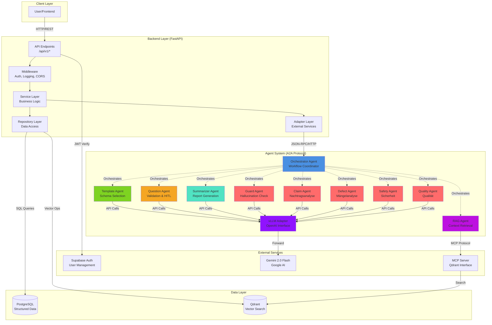
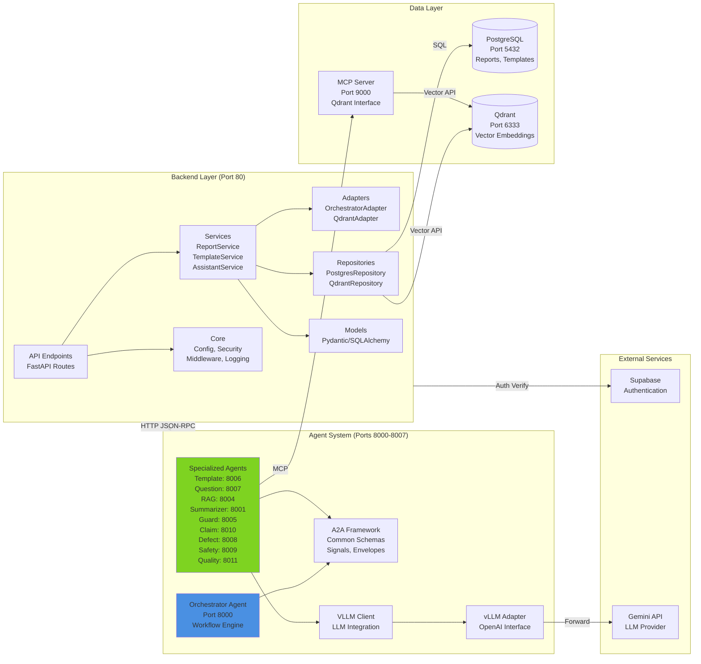

# Lumari Systemarchitektur

## Systemübersicht

Lumari ist ein verteiltes KI-gestütztes Berichtserstellungssystem, das unstrukturierte Transkripte unter Verwendung einer Multi-Agenten-Architektur in strukturierte Berichte umwandelt. Das System kombiniert moderne Backend-Technologien mit fortschrittlicher KI-Agenten-Orchestrierung, um präzise, kontextbezogene Berichte mit menschlicher Aufsicht zu liefern.

### Kernkomponenten

1. **FastAPI Backend** - API-Gateway und Geschäftslogik-Schicht
2. **Multi-Agenten-System** - A2A-Protokoll-basierte Agenten-Orchestrierung
3. **PostgreSQL** - Relationale Datenbank für strukturierte Daten
4. **Qdrant** - Vektordatenbank für semantische Suche
5. **Supabase** - Authentifizierung und Benutzerverwaltung
6. **Gemini 2.0 Flash** - Large Language Model für KI-Verarbeitung

### Hauptfunktionen

- Vorlagenbasierte Berichtserstellung
- Human-in-the-Loop (HITL) Workflow zur Qualitätssicherung
- Semantische Suche mit RAG (Retrieval-Augmented Generation)
- Halluzinationserkennung und -vermeidung
- Multi-Agenten-Orchestrierung mit Zustandspersistenz
- RESTful API mit JWT-Authentifizierung

## High-Level Architektur



## Komponentendiagramm



## Komponentenbeschreibungen

### 1. Backend-Schicht (FastAPI)

#### 1.1 API Endpunkte (`/backend/app/api/v1/endpoints/`)

RESTful API Endpunkte, organisiert nach Ressourcen:

- **transcripts.py**: Transkript-Übermittlung und Berichtserstellung
  - `POST /transcripts/generate` - Haupt-Endpunkt zur Berichtserstellung
  - `POST /transcripts/intake` - Vereinfachter Aufnahme-Endpunkt

- **templates.py**: Vorlagen-Management
  - `POST /templates` - Neue Vorlagen hochladen
  - `GET /templates/user` - Verfügbare Vorlagen auflisten
  - `GET /templates/{id}` - Spezifische Vorlage abrufen

- **reports.py**: Berichts-Operationen
  - `GET /reports/user` - Benutzerberichte auflisten
  - `POST /reports/{id}/finalize` - Entwurfsbericht finalisieren
  - `POST /reports/batch` - Batch-Upload von Berichten
  - `DELETE /reports/{id}` - Bericht löschen

- **assistant.py**: KI-Assistenzfunktionen
  - `POST /assistant/check-questions` - Auf Fragen prüfen ohne vollständige Generierung
  - `POST /assistant/ask` - Fragen zu Berichten stellen

- **orchestration.py**: Workflow-Management
  - `POST /orchestration/resume` - HITL-Workflow mit Antworten fortsetzen

#### 1.2 Service-Schicht (`/backend/app/services/`)

Geschäftslogik und Orchestrierung:

- **report_service.py**: Kernlogik der Berichtserstellung
  - `generate_report_from_transcript()` - Haupt-Workflow-Orchestrierung
  - `finalize_report()` - Berichtsfinalisierung und Qdrant-Synchronisation
  - `list_reports()` - Berichtsabruf mit Filterung

- **template_service.py**: Vorlagen-Operationen
  - `upload_template()` - Vorlagenvalidierung und Speicherung
  - `get_templates()` - Vorlagenabruf und Suche

- **assistant_service.py**: Assistenz-Funktionalität
  - `check_questions()` - Fragengenerierung ohne vollständige Pipeline
  - `ask_question()` - RAG-basierte Fragenbeantwortung

- **supabase_service.py**: Authentifizierungs-Helfer
  - `verify_jwt()` - Token-Validierung
  - `get_user_info()` - Extraktion von Benutzermetadaten

#### 1.3 Repository-Schicht (`/backend/app/repositories/`)

Abstraktion des Datenzugriffs:

- **postgres_repository.py**: PostgreSQL-Operationen
  - CRUD-Operationen für Berichte und Vorlagen
  - Query-Builder mit Filterung
  - Transaktionsmanagement

- **qdrant_repository.py**: Qdrant-Operationen
  - Vektorsuche für Berichte und Vorlagen
  - Upsert-Operationen mit Embeddings
  - Collections-Management

#### 1.4 Adapter-Schicht (`/backend/app/adapters/`)

Integration externer Dienste:

- **orchestrator_adapter.py**: Kommunikation mit dem Agentensystem
  - `process_transcript()` - Orchestrator-Workflow aufrufen
  - `submit_answers()` - HITL-Workflow fortsetzen
  - HTTP-Client mit Retry-Logik

- **qdrant/*.py**: Qdrant-Adapter
  - `reports_ports.py` - Berichtsspezifische Qdrant-Operationen
  - `templates_port.py` - Vorlagenspezifische Qdrant-Operationen

#### 1.5 Modelle (`/backend/app/models/`)

Datenstrukturen und Schemata:

- **api/**: Pydantic-Modelle für API-Verträge
  - `report_models.py` - Request/Response-Modelle für Berichte
  - `template_models.py` - API-Modelle für Vorlagen
  - `error_models.py` - Fehlerantwort-Strukturen

- **sql/**: SQLAlchemy ORM-Modelle
  - `sql_models.py` - Datenbanktabellen-Definitionen

- **qdrant/**: Qdrant-Punkt-Modelle
  - `qdrant_models.py` - Vektorpunkt-Strukturen

#### 1.6 Core (`/backend/app/core/`)

Querschnittsaufgaben:

- **config.py**: Konfigurationsmanagement
  - Laden von Umgebungsvariablen
  - Einstellungsvalidierung
  - Konstruktion der Datenbank-URL

- **security.py**: Sicherheits-Utilities
  - JWT-Validierung
  - Passwort-Hashing (falls benötigt)
  - CORS-Konfiguration

- **middleware.py**: FastAPI Middleware
  - Request/Response Logging
  - Fehlerbehandlung
  - Performance-Monitoring

- **logging.py**: Strukturiertes Logging
  - Log-Formatierung (JSON/pretty)
  - Log-Level-Konfiguration
  - Kontext-Injection

- **ratelimit.py**: Ratenbegrenzung
  - Token Bucket Algorithmus
  - Pro-Benutzer-Ratenlimits
  - Endpunkt-spezifische Limits

- **exceptions.py**: Benutzerdefinierte Exceptions
  - Geschäftslogik-Exceptions
  - Mapping zu HTTP-Exceptions

- **handlers.py**: Globale Exception-Handler
  - Abfangen unbehandelter Exceptions
  - Formatierung von Fehlerantworten

#### 1.7 Abhängigkeiten (`/backend/app/dependencies/`)

FastAPI Dependency Injection:

- **auth.py**: Authentifizierungs-Abhängigkeiten
  - `get_current_user()` - Benutzer aus JWT extrahieren
  - `require_auth()` - Authentifizierung erzwingen

- **dependencies.py**: Allgemeine Abhängigkeiten
  - Datenbanksitzungs-Management
  - Service-Instanz-Erstellung

#### 1.8 MCP Services (`/backend/app/mcp_services/`)

Model Context Protocol Server:

- **qdrant_mcp_server.py**: MCP-Server für Qdrant-Zugriff
  - Bietet standardisierte Schnittstelle für Agenten
  - Handhabt Embedding-Generierung
  - Verwaltet Qdrant-Verbindungen

### 2. Agentensystem (A2A-Protokoll)

<details>
<summary><strong>2.1 Orchestrator Agent</strong> (<code>/a2a-multi-agent/agents/orchestrator_agent/</code>)</summary>

Workflow-Koordination und Zustandsverwaltung:

- **executor.py**: Haupt-Orchestrierungslogik
  - Ausführung der Agenten-Pipeline
  - Signalverarbeitung (CONTINUE, SUSPEND, ERROR)
  - Zustandspersistenz und Wiederherstellung

- **planning.py**: Workflow-Planung
  - Agentenauswahl basierend auf Anfrage
  - Abhängigkeitsauflösung
  - Bestimmung der Ausführungsreihenfolge

- **persistence.py**: Zustandsverwaltung
  - Serialisierung des Ausführungszustands
  - Artefakt-Speicherung (Vorlagenergebnisse, Kontexte)
  - Zustandswiederherstellung für HITL-Resume

- **artifacts.py**: Datenübergabe zwischen Agenten
  - Artefakt-Erstellung und -Abruf
  - Kontext-Akkumulation
  - Ergebnisaggregation

- **app.py**: FastAPI Anwendung
  - `/process` - Neuen Workflow starten
  - `/resume` - Ausgesetzten Workflow fortsetzen
  - `/status` - Workflow-Status prüfen

**Konfiguration:**
- Port: 8000
- Protokoll: HTTP mit JSON-RPC
- Persistenz: Dateibasiert (JSON) oder Redis
- Timeout: 60 Sekunden pro Agent
</details>

<details>
<summary><strong>2.2 Template Agent</strong> (<code>/a2a-multi-agent/agents/template_agent/</code>)</summary>

Vorlagenauswahl und -abgleich:

- **executor.py**: Vorlagen-Abgleichslogik
  - Abfrage ähnlicher Vorlagen in Qdrant via MCP
  - LLM-basierte Vorlagenauswahl
  - Schema-Extraktion

- **load_template.py**: Vorlagen-Lade-Utilities
  - Vorlagen-JSON parsen
  - Schema validieren
  - Metadaten extrahieren

- **models.py**: Pydantic-Modelle
  - TemplateResult Schema
  - Vorlagenauswahl-Kriterien

**Port:** 8006
**Eingabe:** Transkript
**Ausgabe:** Ausgewähltes Vorlagenschema
**Signal:** Immer CONTINUE
</details>

<details>
<summary><strong>2.3 Question Agent</strong> (<code>/a2a-multi-agent/agents/question_agent/</code>)</summary>

Transkript-Validierung und Fragengenerierung:

- **executor.py**: Fragengenerierungs-Workflow
  - Transkript gegen Vorlage validieren
  - Fehlende Informationen identifizieren
  - Klärungsfragen generieren

- **logic.py**: Kern-Validierungslogik
  - LLM-basierte Vollständigkeitsprüfung
  - Fragenformatierung
  - Erkennung erforderlicher vs. optionaler Felder

- **models.py**: Fragenschemata
  - QuestionResult Modell
  - Struktur einzelner Fragen

**Port:** 8007
**Eingabe:** Transkript + Vorlagenergebnis
**Ausgabe:** Liste von Fragen ODER Bestätigung
**Signal:** SUSPEND (bei Fragen) oder CONTINUE (wenn vollständig)
</details>

<details>
<summary><strong>2.4 RAG Agent</strong> (<code>/a2a-multi-agent/agents/rag_agent/</code>)</summary>

Kontextabruf aus historischen Berichten:

- **executor.py**: RAG-Workflow-Orchestrierung
  - Abruf und Ranking koordinieren
  - Ergebnisse nach Relevanz filtern

- **retrieving.py**: Vektorsuchlogik
  - Query-Embeddings generieren
  - Qdrant via MCP abfragen
  - Ergebnisse ranken und filtern

- **config.py**: RAG-Konfiguration
  - Top K Ergebnisse (Standard: 5)
  - Ähnlichkeitsschwellenwert
  - Kontextfenstergröße

**Port:** 8004
**Eingabe:** Transkript + Vorlage
**Ausgabe:** Relevante historische Berichte
**Signal:** Immer CONTINUE
</details>

<details>
<summary><strong>2.5 Summarizer Agent</strong> (<code>/a2a-multi-agent/agents/summarizer_agent/</code>)</summary>

Berichtserstellung:

- **executor.py**: Zusammenfassungs-Workflow
  - Alle Eingaben aggregieren (Transkript, Vorlage, RAG, Antworten)
  - LLM für Berichtserstellung aufrufen
  - Ausgabe gemäß Vorlage formatieren

- **summarization.py**: LLM-Prompting-Logik
  - Umfassenden Prompt konstruieren
  - Strukturierte Ausgabe handhaben
  - Vorlagenformatierung anwenden

- **models.py**: Ausgabeschemata
  - SummarizerResult Modell
  - Berichtsmetadaten

**Port:** 8001
**Eingabe:** Transkript + Vorlage + RAG-Kontext + Antworten
**Ausgabe:** Generierter Berichtsinhalt
**Signal:** Immer CONTINUE
</details>

<details>
<summary><strong>2.6 Guard Agent</strong> (<code>/a2a-multi-agent/agents/guard_agent/</code>)</summary>

Halluzinationserkennung:

- **executor.py**: Wächter-Workflow
  - Bericht gegen Originaltranskript vergleichen
  - Nicht unterstützte Behauptungen erkennen
  - Halluzinationen markieren

- **guarding.py**: Erkennungslogik
  - LLM-basierter Faktencheck
  - Quellenattributionsvalidierung
  - Konfidenz-Scoring

- **config.py**: Wächter-Schwellenwerte
  - Halluzinations-Sensitivität
  - Retry-Limits

**Port:** 8005
**Eingabe:** Generierter Bericht + Originaltranskript
**Ausgabe:** Validierungsergebnis
**Signal:** CONTINUE (valide) oder ERROR (Halluzination erkannt)
</details>

<details>
<summary><strong>2.7 Claim Agent</strong> (<code>/a2a-multi-agent/agents/claim_agent/</code>)</summary>

Spezialisierter Agent zur Extraktion und Analyse von Nachträgen, Regiearbeiten und Planänderungen.

- **claim_analysis.py**: Kernlogik zur Identifikation von Mehrkosten
- **models.py**: Datenmodelle für Claims

**Port:** 8010
**Eingabe:** Transkript
**Ausgabe:** Claim-Bericht (Nachträge, Zusatzleistungen)
**Signal:** CONTINUE
</details>

<details>
<summary><strong>2.8 Defect Agent</strong> (<code>/a2a-multi-agent/agents/defect_agent/</code>)</summary>

Spezialisierter Agent zur Extraktion und Klassifizierung von Baumängeln.

- **defect_analysis.py**: Logik zur Mängelbewertung und Schweregrad-Einstufung
- **models.py**: Datenmodelle für Mängel

**Port:** 8008
**Eingabe:** Transkript
**Ausgabe:** Mängelbericht (Risse, Schäden, Ausführungsfehler)
**Signal:** CONTINUE
</details>

<details>
<summary><strong>2.9 Safety Agent</strong> (<code>/a2a-multi-agent/agents/safety_agent/</code>)</summary>

Spezialisierter Agent zur Analyse von Arbeitssicherheit.

- **safety_analysis.py**: Erkennung von Unfällen, Gefahren und PSA-Verstößen
- **models.py**: Datenmodelle für Sicherheitsvorfälle

**Port:** 8009
**Eingabe:** Transkript
**Ausgabe:** Sicherheitsbericht (HSE-Compliance)
**Signal:** CONTINUE
</details>

<details>
<summary><strong>2.10 Quality Agent</strong> (<code>/a2a-multi-agent/agents/quality_agent/</code>)</summary>

Spezialisierter Agent für technische Qualitätsdaten.

- **quality_analysis.py**: Extraktion von Materialspezifikationen und Normen
- **models.py**: Datenmodelle für Qualitätsnachweise

**Port:** 8011
**Eingabe:** Transkript
**Ausgabe:** Qualitätsbericht (Materialien, DIN-Normen)
**Signal:** CONTINUE
</details>

<details>
<summary><strong>2.11 A2A Common Framework</strong> (<code>/a2a-multi-agent/a2a_common/</code>)</summary>

Geteilte Infrastruktur für alle Agenten:

- **schemas/**: Input/Output-Schemata für jeden Agententyp
  - `template.py`, `question.py`, `rag.py`, `summarizer.py`, `guard.py`

- **signals.py**: Kontrollfluss-Signale
  - `CONTINUE` - Zum nächsten Agenten fortfahren
  - `SUSPEND` - Auf Benutzereingabe warten (HITL)
  - `ERROR` - Fehler aufgetreten

- **envelope.py**: Nachrichten-Wrapping
  - Request/Response-Umschläge
  - Metadaten (Zeitstempel, Agenten-IDs)

- **remote_agent.py**: Agentenkommunikation
  - HTTP-Client für Inter-Agenten-Aufrufe
  - Retry-Logik
  - Timeout-Behandlung

- **retry.py**: Retry-Utilities
  - Exponentieller Backoff
  - Konfiguration maximaler Versuche

- **logging.py**: Strukturiertes Logging
  - Agentenspezifische Log-Formatierung
  - Korrelations-IDs

- **agent_registry.py**: Agentenerkennung
  - Agentenkonfiguration aus YAML laden
  - Agenten-URLs auflösen

- **utils.py**: Hilfsfunktionen
  - UUID-Generierung
  - Datumsformatierung
</details>

<details>
<summary><strong>2.12 VLLM Client</strong> (<code>/a2a-multi-agent/VLLM_Client/</code>)</summary>

LLM-Integrationsschicht:

- **VLLMClient.py**: OpenAI-kompatibler Client
  - Chat Completions
  - Strukturierte Ausgabe mit Instructor
  - Retry-Logik
  - Token-Nutzungsverfolgung

**Konfiguration:**
- Basis-URL: Google Gemini API (OpenAI-kompatibler Endpunkt)
- Modell: gemini-2.0-flash-exp
- Temperatur: 0.1 (Standard, pro Agent konfigurierbar)
- Max Tokens: 4096
</details>

### 4. Externe Dienste

#### 4.1 Supabase Authentifizierung

**Integration:**
- JWT-Token-Generierung
- Benutzerverwaltung
- Sitzungsbehandlung
- Passwort-Reset

**Backend-Integration:**
- JWT-Validierung in Middleware
- Benutzer-ID-Extraktion aus Token
- Rollenbasierte Zugriffskontrolle (Zukunft)

**Umgebungsvariablen:**
```env
SB_PROJECT_URL=https://xxx.supabase.co
SB_ANON_KEY=eyJhbGci...
```

#### 4.2 Gemini 2.0 Flash (Google AI)

**Integration:**
- OpenAI-kompatibler API-Endpunkt
- Chat Completions
- Strukturierte Ausgabe (via Instructor)

**Konfiguration:**
```env
VLLM_BASE_URL=https://generativelanguage.googleapis.com/v1beta/openai/
VLLM_API_KEY=AIza...
VLLM_MODEL=gemini-2.0-flash-exp
```

**Nutzung:**
- Vorlagenauswahl (Template Agent)
- Fragengenerierung (Question Agent)
- Berichtserstellung (Summarizer Agent)
- Halluzinationserkennung (Guard Agent)
